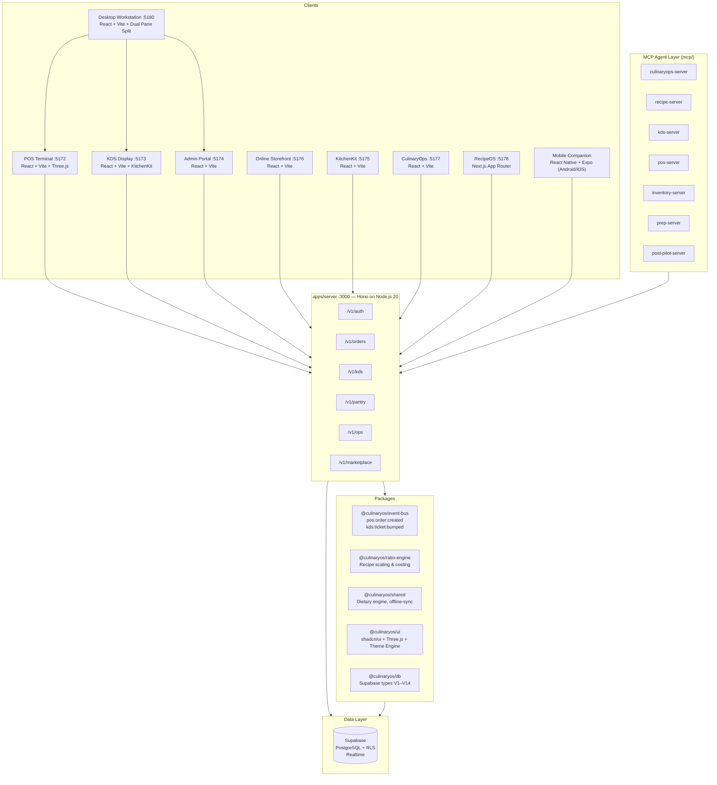

# CulinaryOS

**The open operating system for restaurants** — humans on POS/KDS, agents on MCP, your Postgres. MIT licensed. AI never required for service.

**Live Marketing Hub & Overview:** [https://culinary-os-marketing.vercel.app/](https://culinary-os-marketing.vercel.app/)

[](https://culinary-os-marketing.vercel.app/)
[](https://github.com/ShadowWalkerNC/CulinaryOS/actions/workflows/ci.yml)
[](./scripts/run-all-tests.cjs)
[](./turbo.json)
[](./packages/ui)
[](./LICENSE)
[](https://www.typescriptlang.org/)
[](./CHANGELOG.md)

<p align="center">
  
  
</p>
<p align="center">
  
  
</p>

<p align="center"><em>3D Spatial Floor Plan · Real-Time Kitchen Display (KitchenKit) · Multi-Seat POS Terminal · Online Ordering Storefront</em></p>

> Not a cheaper Toast clone. A **protocol restaurant**: kitchen state is a versioned contract that operators *and* AI agents can drive — with sovereign data and a closed economic loop (recipe → fire → waste/cost).

---

## ⚡ 1-Click Turnkey Installers & Desktop Shortcuts

Install and launch CulinaryOS across any platform with zero manual configuration:

### 🪟 Windows 10 / 11 (1-Click Desktop Installer)
Double-click [**`Install-CulinaryOS.bat`**](Install-CulinaryOS.bat) in File Explorer (or run via PowerShell):
```powershell
.\Install-CulinaryOS.bat
```
- Automatically installs Node.js LTS (via `winget` if missing) and `pnpm`.
- Creates a permanent **`CulinaryOS` shortcut on your Windows Desktop**.
- **Auto-Updates on Launch:** Double-clicking the Desktop Icon automatically syncs to the latest repository commit via `git pull --rebase` before booting services!
- To configure Windows Defender Firewall for local tablets/iPads, double-click [**`scripts/setup-firewall.bat`**](scripts/setup-firewall.bat).

### 🍎 macOS & Linux (1-Click Bash Launcher)
```bash
./START_HERE.sh
```

### 📱 Connecting Tablets & Mobile Devices (Over Wi-Fi)
All servers bind to `0.0.0.0` with dynamic LAN routing. Simply open `http://<YOUR_WIFI_IP>:5172` (e.g. `http://192.168.1.50:5172`) on any iPad, Android terminal, or kitchen TV display connected to your local network.

### ☁️ Deploy Online (Render & Vercel)
- **Render Blueprint:** Deploy the Unified API, Web Storefront, and Admin portals using the included [`render.yaml`](render.yaml).
- **Vercel Frontend:** Deploy the guest digital ordering app with 1-click using [`vercel.json`](vercel.json).

---

## What is CulinaryOS?

CulinaryOS is a **complete, MIT-licensed restaurant operating system** built as a TypeScript monorepo. It covers every surface of a modern food-service operation:

- **Desktop Workstation (`:5180`)** — Unified restaurant workstation with F1–F7 hotkeys, PIN manager, and full-screen Kiosk mode.
- **POS Terminal (`:5172`)** — PIN-authenticated, offline-first, multi-tender (card, tap, QR, cash, comp) with ESC/POS hardware thermal printing.
- **Kitchen Display System (`:5173`)** — Real-time ticket aging, station routing, multi-course hold/fire with high-contrast OLED mode.
- **Admin Back-Office (`:5174`)** — Menu builder, 86ing, staff PINs, pantry par levels, purchase orders, and system settings.
- **KitchenKit & Prep Planner (`:5175`)** — Recipe formulas, yield calculations, batch sizing, adhesive FIFO QR labels, and vendor POs.
- **Online Storefront (`:5176`)** — Guest ordering with FDA Top 9 dietary filtering, allergen matrices, tableside QR pay, and checkout.
- **CulinaryOps (`:5177`)** — Actual vs theoretical food cost variance, kitchen waste logging, labor % tracking, and plate economics.
- **Universal CLI Tool (`cli/`)** — Command-line interface to control any screen, order, ticket, recipe, or inventory level.
- **RecipeOS Vault (`:5178`)** — Next.js recipe vault, ratio scaling engine, unit conversions, and shopping list.
- **Android Mobile POS (`mobile/`)** — React Native + Expo companion app with offline SQLite cache.
- **Unified Hono API (`:3000`)** — Single source of truth for orders, inventory, ops, payments, and settings.
- **MCP Agent Layer (`mcp/`)** — 9 specialized Model Context Protocol servers that let AI agents operate on live restaurant state.

All surfaces share a single Supabase PostgreSQL backend with Row Level Security (RLS) enforcing strict multi-tenant isolation. The AI layer is **strictly additive** — every core operation works identically with or without an Anthropic API key.

---

## 🛠️ Universal CLI Tool (`culinary`)

CulinaryOS includes a full-featured CLI to control every surface, order, ticket, and table in the system:

```bash
# Build the CLI tool
pnpm --filter culinary-cli build

# Front-of-House POS Operations
culinary pos list                              # View active dining room orders
culinary pos seat 4 --covers 4                 # Seat guests at Table 4
culinary pos fire 4 "Burger" "Pizza"           # Ring up & fire items to kitchen
culinary pos merge 5 4 6                       # Merge tables 4 & 6 into Table 5
culinary pos void ord-1 item-2 "Overcooked" 5678 # Void post-send item with Manager PIN
culinary pos pay ord-1 --method card           # Settle bill with card / tap

# Back-of-House Kitchen Display Operations
culinary kds list                              # View live kitchen tickets & aging
culinary kds bump tkt-101 --station expo       # Bump completed ticket
culinary kds fire-course ord-1 2               # Fire Course 2 (Entrees)
culinary kds 86 "Ribeye" 4                     # Set 86 countdown: 4 remaining

# Food Cost & Kitchen Operations
culinary ops waste item-3 5.0 "Burnt"          # Log kitchen scrap & auto-calculate loss
culinary ops food-cost                         # Actual vs theoretical food cost variance
culinary ops labor                             # Shift labor hours & labor % report

# KitchenKit Batch Prep & Adhesive Labels
culinary prep scale "Pizza Dough" --factor 3.5 # Scale batch formula 3.5x
culinary prep label "Marinara Sauce" --shelfLife 48 # Generate adhesive FIFO QR label
culinary prep par                              # Low-stock pantry items & auto-draft PO

# System Diagnostics & Device Discovery
culinary system doctor                         # Port scan & health diagnostic
culinary system heal                           # Auto-kill zombie conflicting processes
culinary system tray                           # Launch Windows skillet tray daemon
culinary system discover                       # Broadcast mDNS (culinaryos.local) & QR
```

---

## Architecture



---

## 🎨 shadcn/ui Design System & Universal Theme Engine

CulinaryOS includes a centralized design system in `@culinaryos/ui` built on **Radix UI**, **Tailwind CSS**, and **Three.js**, with a live **Theme Customizer**:

### Theme Presets
- **Classic Bistro (Light)**: Clean warm linen, balanced typography, elegant fine dining.
- **Midnight Slate (Dark)**: Deep navy slate (`#090d16`), cyan accents, low-light evening bar feel.
- **Kitchen OLED (Pure Black `#000000`)**: Zero eye strain high-heat high-contrast mode for busy commercial kitchen lines.
- **Cyberpunk Neon**: Electric cyan (`#06b6d4`), magenta accents, modern lounge style.
- **Botanical Garden (Emerald)**: Forest green (`#047857`), sage, warm cream farm-to-table aesthetic.
- **Bordeaux & Wine**: Intimate steakhouse, ruby crimson (`#e11d48`), rich deep tones.

### Micro-Interaction Animations
- `.animate-ticket-arrive`: Spring bounce animation (`cubic-bezier(0.34, 1.56, 0.64, 1)`) on order fire.
- `.animate-ticket-bump`: Smooth exit slide & scale fade on KDS ticket completion.
- `.animate-scale-spring`: Elastic button pop and table focus feedback.

See [`docs/UI_THEME_CUSTOMIZER.md`](docs/UI_THEME_CUSTOMIZER.md) for direct CSS token export and React usage.

---

## Surfaces & Applications

| Package | Port / Target | Role |
|---|---|---|
| `apps/desktop` | `:5180` | **Desktop Workstation Hub** — Unified split-screen manager, F1–F6 hotkeys, theme switcher, kiosk mode |
| `apps/marketing` | `:5179` | **CulinaryOS.io SaaS Portal** — Next.js 14 marketing, pricing matrix, trial signup, blog, and RecipeOS showcase |
| `apps/server` | `:3000` | Unified Hono API — authentication, orders, KDS, reservations, pantry, payments, billing, ops, marketplace |
| `apps/pos` | `:5172` | POS terminal (PIN login, 2D/3D floor map, ESC/POS hardware printer hub, live text scaling, PWA offline) |
| `apps/kds` | `:5173` | Kitchen Display System (real-time tickets, station filters, course hold/fire, TV 140% mode, PWA offline) |
| `apps/admin` | `:5174` | Admin portal — menu editor, staff PINs, custom role builder, pantry par levels, system settings, themes |
| `apps/kitchenkit` | `:5175` | KitchenKit — Recipe catalog, station prep planner, par levels, vendor management, shelf life |
| `apps/web` | `:5176` | Online ordering storefront (FDA Top 9 dietary filtering, cart customization, instant checkout) |
| `apps/ops` | `:5177` | CulinaryOps — Real-time food cost analytics, waste logging, labor %, and vendor performance |
| `apps/recipeos` | `:5178` | RecipeOS — Next.js recipe vault, ratio scaling engine, unit conversions, and shopping list |
| `mobile/` | Android/iOS | React Native + Expo Mobile POS with offline SQLite cache |
| `packages/sdk` | Shared | **@culinaryos/sdk** — Official TypeScript Client SDK for orders, KDS, reservations, billing, reports |
| `packages/commissary-engine` | Shared | Multi-unit stock replenishment, central production batching, and franchise royalty ledgers |
| `packages/forecast-engine` | Shared | Predictive kitchen demand smoothing, bottleneck advisories, and adaptive safety-stock par levels |
| `packages/loyalty-engine` | Shared | Customer points, digital punch cards, gift card redemption, and dual-sided referral credits |
| `packages/accounting-engine` | Shared | Double-entry General Ledger reconciliation, QuickBooks Online IIF, Xero CSV, and P&L metrics |
| `packages/ui` | Shared | Centralized **shadcn/ui** design system, Three.js 3D canvas, and Universal Theme Engine |
| `packages/shared` | Shared | Unified settings engine, dietary filter engine, printer driver, offline-sync delta engine |
| `packages/ratio-engine` | Shared | Baker's percentage calculations, yield formulas, and batch scaling |
| `packages/prep-engine` | Shared | Recipe prep task management and batch requirement calculations |
| `packages/food-cost-engine` | Shared | Pure functions for actual vs theoretical food cost variance calculations |
| `packages/waste-engine` | Shared | Kitchen waste summarization and top cost-leakage analysis |
| `packages/labor-engine` | Shared | Shift labor hours, role-weighted tip pooling, and labor cost percentage calculations |
| `packages/pdf-tools` | Shared | Print-ready PDF menu export, Z-Report financial closeout PDF, and QR code generators |
| `packages/template-engine` | Shared | Multi-concept restaurant website and menu template token engine |
| `packages/seo-tools` | Shared | Schema.org JSON-LD structured data generators for restaurant menus and locations |
| `packages/asset-tools` | Shared | OpenGraph banner generator (`satori`), favicons, and palette extractors |
| `mcp/` | Extension | 9 Model Context Protocol servers + Python Post-Pilot loyalty agent |

---

## Quick Start (Local Demo Mode)

Run the entire system locally in under 30 seconds with **zero database setup and zero external API keys**:

### Prerequisites

- [Node.js 20+](https://nodejs.org/)
- [pnpm 9+](https://pnpm.io/installation) (`npm install -g pnpm`)

### Boot

```bash
# 1. Clone repository and install dependencies
git clone https://github.com/ShadowWalkerNC/CulinaryOS.git
cd CulinaryOS
pnpm install

# 2. One-command turnkey boot (launches Desktop Hub, POS, KDS, Admin, Web, and API)
pnpm quickstart
```

*(On Windows you can also run `.\scripts\install.ps1`, or `./scripts/install.sh` on macOS/Linux).*

**Interactive walkthrough:** See [`QUICKSTART.md`](QUICKSTART.md).

### Demo Credentials

| Surface | URL | Credential |
|---|---|---|
| **Desktop Workstation** | [localhost:5180](http://localhost:5180) | F1–F6 quick switch · Kiosk mode · Split view |
| **POS Terminal** | [localhost:5172](http://localhost:5172) | Server PIN: `1234` · Manager PIN: `5678` |
| **Kitchen Display (KDS)** | [localhost:5173](http://localhost:5173) | No login required |
| **Admin Portal** | [localhost:5174](http://localhost:5174) | No login required |
| **Online Storefront** | [localhost:5176](http://localhost:5176) | No login required |
| **KitchenKit** | [localhost:5175](http://localhost:5175) | No login required |
| **CulinaryOps** | [localhost:5177](http://localhost:5177) | No login required |
| **RecipeOS** | [localhost:5178](http://localhost:5178) | No login required |
| **Unified Hono API** | [localhost:3000](http://localhost:3000) | `X-Tenant-Id: 00000000-0000-0000-0000-000000000001` |

In offline/demo mode, POS serves a sample menu, buffers transactions to localStorage, and communicates with the in-memory mock kitchen store on the API. POS and KDS do **not** share live state in demo mode — use a live Supabase backend for cross-app POS→KDS order flow.

---

## Operations Consultant & Daily Audits

CulinaryOS includes an autonomous **Restaurant Operations Manager & Consultant** framework for continuous review of hospitality workflows:

```bash
# Run daily operations audit & generate report
pnpm ops:audit

# View the latest operational critique
cat docs/DAILY_OPERATIONS_REPORT.md
```

The audit evaluates speed-of-service, touchscreen ergonomics, KDS course hold/fire timers, FDA Top 9 allergen classifications, and shared fryer cross-contact risks, and generates targeted daily operational questions for engineering refinement.

---

## Connecting to Live Supabase Backend

To enable multi-device sync, PostgreSQL Row Level Security (RLS), and live Supabase Realtime:

1. Provide valid keys in `.env`:
   ```env
   SUPABASE_URL=https://your-project.supabase.co
   SUPABASE_ANON_KEY=eyJ...
   SUPABASE_SERVICE_ROLE_KEY=eyJ...
   AUTH_RELAXED=false
   ```
2. Apply database migrations:
   ```bash
   npx supabase db reset
   ```
3. Seed default tenant, menu, and staff PINs:
   ```bash
   pnpm seed
   ```
4. Start the stack — POS, KDS, Admin, and MCP agents will now operate on your live database with strict tenant isolation.

See [`docs/DEPLOYMENT.md`](docs/DEPLOYMENT.md) for full Docker Compose and cloud hosting options.

---

## Quality & Testing Gate

CulinaryOS enforces strict quality gates across the monorepo:

```bash
# Run complete test suite (32 test suites, 110+ tests)
node ./scripts/run-all-tests.cjs

# Run workspace-wide typecheck (18 tasks across all packages — 0 errors)
pnpm run typecheck

# Build all packages and applications
pnpm run build

# Run production readiness preflight doctor
pnpm doctor
```

> **Note on lint:** `pnpm run lint` is currently non-functional (eslint configs pending). Use `pnpm typecheck` as the static analysis gate.
>
> **Note on `pnpm test`:** The Turborepo root `#test` task has a known recursive-invocation issue. Use `node ./scripts/run-all-tests.cjs` or `bun test tests/server/` directly.

---

## Repository Structure

```
CulinaryOS/
├── apps/
│   ├── server/          ← Unified Hono API (orders, KDS, pantry, ops, payments)
│   ├── pos/             ← POS terminal (React / Vite / shadcn / Three.js)
│   ├── kds/             ← Kitchen Display client (React / Vite)
│   ├── admin/           ← Admin / pantry portal (React / Vite)
│   └── web/             ← Online ordering storefront (React / Vite)
├── packages/            ← shared, event-bus, auth, db, ui, config, ratio-engine
├── mcp/                 ← 9 MCP servers — AI agent tool layer
├── extensions/          ← First-party extension manifests
├── extension_template/  ← Public contract for third-party extensions
├── mobile/              ← React Native + Expo companion (stub)
├── supabase/            ← Migrations + seeds (V1–V14)
├── cli/                 ← Operator CLI tool
├── tests/               ← Integration + e2e tests
├── docs/                ← Technical documentation
├── scripts/             ← quickstart, seed, doctor, simulate, ops-audit
├── docker-compose.yml   ← Production container build
├── pnpm-workspace.yaml  ← Monorepo workspace config
├── turbo.json           ← Turborepo pipeline config
└── .env.example         ← All required env vars
```

---

## Screenshots

> All screenshots captured live from the running application.

### 3D Spatial Floor Plan & Table Management
<p align="center">
  
</p>

### Kitchen Display System (KitchenKit — Station Routing)
<p align="center">
  
</p>

### POS Terminal — Multi-Seat Ticket Menu
<p align="center">
  
</p>

### Online Customer Storefront
<p align="center">
  
</p>

### Additional Screens
<p align="center">
  
  
  
</p>
<p align="center">
  
  
  
</p>

---

## Contributing

We welcome contributions! Please read [`CONTRIBUTING.md`](CONTRIBUTING.md) before opening a PR.

- **Branch naming:** `feature/[module]-[description]` · `fix/[module]-[issue]` · `docs/[scope]`
- **Commit format:** [Conventional Commits](https://www.conventionalcommits.org/) — `feat(pos): ...`, `fix(kds): ...`, `docs(readme): ...`
- **Non-negotiable:** every database query must be scoped by `tenant_id` / RLS. Unscoped queries are rejected.

---

## Community & Support

- **Bug reports & feature requests:** [GitHub Issues](https://github.com/ShadowWalkerNC/CulinaryOS/issues)
- **Questions & discussion:** [GitHub Discussions](https://github.com/ShadowWalkerNC/CulinaryOS/discussions)
- **Architecture & API docs:** [`docs/`](docs/)
- **Extension development:** [`extension_template/`](extension_template/)

---

## License

[MIT](./LICENSE) — Own your stack. Built with TypeScript, React, Vite, Three.js, Radix UI, Hono, Supabase, Turborepo, and Model Context Protocol (MCP).
