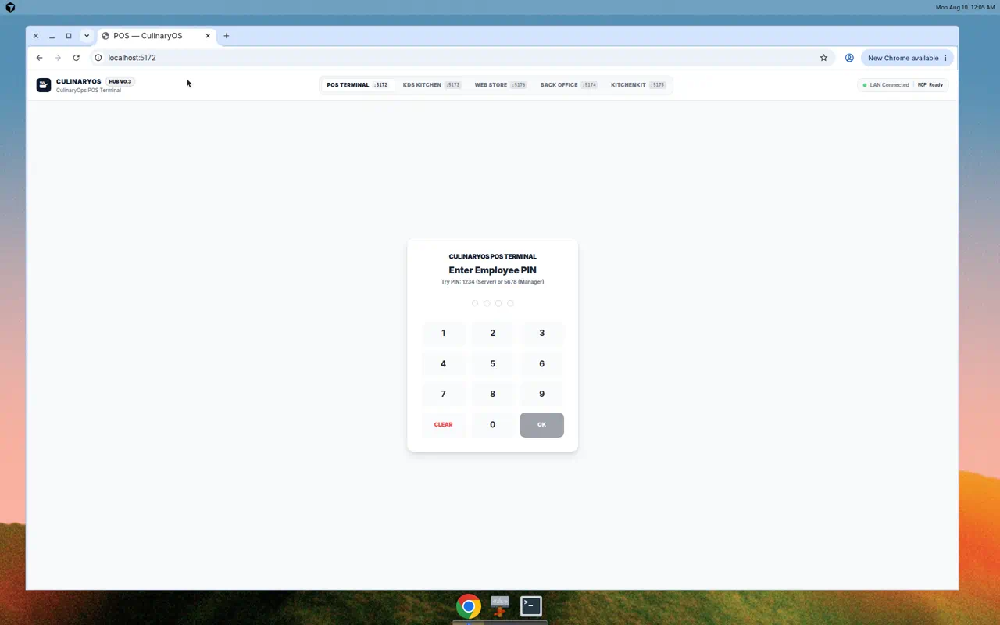
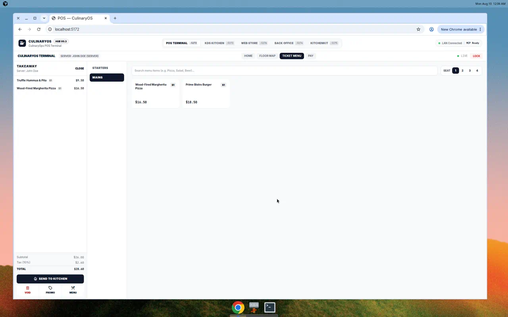
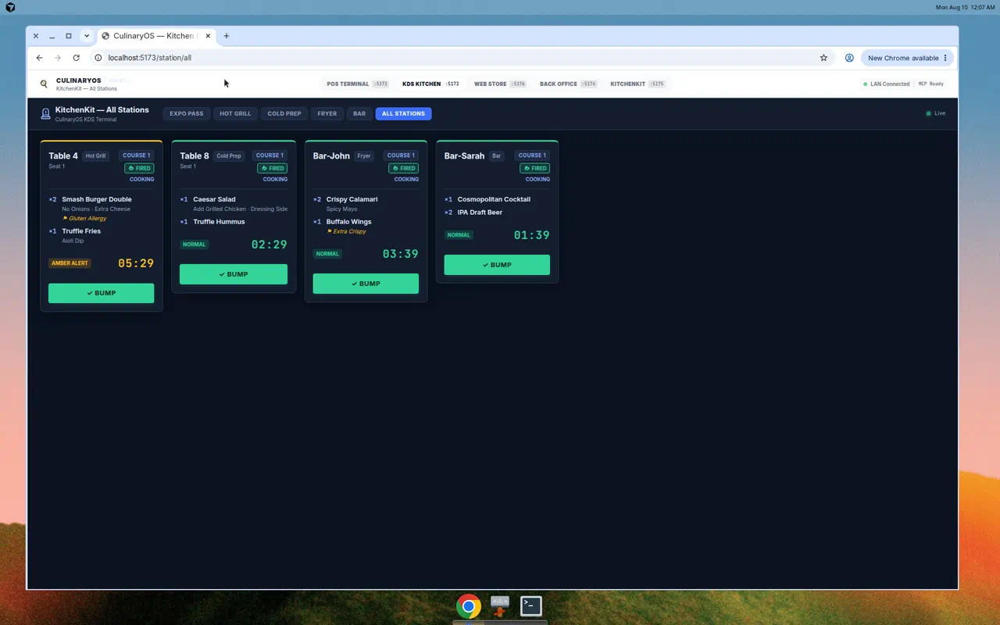

# CulinaryOS

> **The AI‑native operating system for restaurants.** One open‑source, self‑hostable platform that runs the whole floor — point of sale, kitchen display, online ordering, and inventory — and exposes every operation as a tool your AI agents can actually use.


| POS — sign in | POS — live ticket | KDS — kitchen board |
|---|---|---|
|  |  |  |

---

## The pitch

Restaurant software is a racket: closed, per‑terminal licensing; hardware lock‑in; data you can't get at; and "AI features" that are a chatbot bolted onto a database. Meanwhile the actual work — costing a recipe, scaling a batch, firing a course, chasing food cost and labor — still happens in spreadsheets and heads.

**CulinaryOS is the opposite of that:**

- **Free & open‑source, forever.** MIT‑licensed and free to all — no per‑terminal fees, no license keys, no seats, no lock‑in. Own your data and your stack; run it on a tablet, a kitchen display, a laptop, or your own cloud, and fork it if you want.
- **Web‑first, zero install.** POS, KDS, admin, and the customer storefront are all React apps in the browser — no app‑store gatekeeping, no native builds.
- **Works before you configure anything.** Clone, `pnpm dev`, and it runs in a fully interactive **demo mode** with a seeded menu and live kitchen board — no database, no keys. Add Supabase when you're ready for real data.
- **Genuinely AI‑native.** Every operation is exposed over the **Model Context Protocol (MCP)**, so Claude, Cursor, or your own agent can take orders, fire courses, check stock, and pull reports — through the same guarded API your staff use, never raw database access.
- **A costing engine, not a price field.** The **Ratio Blueprint Engine** stores recipes as *relationships* (baker's percentages), so scaling a batch, projecting food cost, and swapping sub‑recipes are exact math — not guesses.
- **An ecosystem, not a monolith.** CulinaryOS is a hub. Focused satellite products (KitchenKit, CulinaryOps, Post‑Pilot) plug in as MCP bridges, so the platform grows without turning into one giant blob.

**Who it's for:** independent restaurants, ghost kitchens, caterers, and multi‑location groups that want to own their operations software — and builders who want a real, hackable restaurant platform to extend.

---

## How it works

### 1. One monorepo, five surfaces, one gateway

```
                   Guests            Servers          Line cooks         Managers
                     │                  │                  │                 │
              apps/web (:5176)   apps/pos (:5172)   apps/kds (:5173)  apps/admin (:5174)
              online ordering    POS terminal       kitchen display   back office
                     └──────────────────┴───────┬──────────┴─────────────────┘
                                                 │  HTTP + Supabase Realtime
                                     apps/server (:3000) — Hono API gateway
                                                 │
                          Supabase (Postgres · Auth · Realtime · Row‑Level Security)
```

All four frontends talk to a single **Hono API gateway** (`apps/server`, Node 20). State lives in **Supabase** — Postgres with Row‑Level Security so every row is scoped to a tenant. Realtime is how the kitchen sees new tickets the instant they're fired.

### 2. The core loop: order → fire → cook → pay

1. A server builds a check on the **POS**; items, modifiers, seats, and course numbers are attached.
2. Hitting **Send to Kitchen** calls the gateway, which emits a `pos:order:created` domain event.
3. The **event bus** (`@culinaryos/event-bus`) turns that event into `kitchen_tickets`, routed by station and course.
4. The **KDS** receives the ticket over Supabase Realtime, ages it with color‑coded timers, and lets the line **bump** it when it's up.
5. Payment runs through Stripe **PaymentIntents** (no raw card data on the server); every mutation is written to an append‑only `domain_events` audit log.

Offline‑by‑design: if the network drops, the POS keeps taking orders in a local queue and syncs on reconnect.

### 3. The differentiator: the Ratio Blueprint Engine

Traditional POS software stores `500g flour`. CulinaryOS stores `flour: 100%` and understands the *relationship* — so it can scale, cost, and substitute with real math. It's a zero‑dependency package (`@culinaryos/ratio-engine`).

```typescript
import { scaleBlueprint, computeCost } from '@culinaryos/ratio-engine';

const sourdough = {
  id: 'sourdough-boule', name: 'Sourdough Boule', baseYield: 1, yieldUnit: 'loaf',
  ingredients: [
    { id: 'flour',   name: 'Bread Flour', ratioWeight: 100, unit: 'g' },
    { id: 'water',   name: 'Water',       ratioWeight: 75,  unit: 'ml' },
    { id: 'starter', name: 'Starter',     ratioWeight: 20,  unit: 'g' },
    { id: 'salt',    name: 'Salt',        ratioWeight: 2,   unit: 'g' },
  ],
};

const scaled = scaleBlueprint(sourdough, 12);   // 12 loaves — ratios preserved, exactly
```

### 4. AI‑native, via MCP

CulinaryOS exposes its operations as **MCP servers** (`mcp/`). Any MCP‑compatible agent — Claude Desktop, Cursor, your own — connects and drives the platform through the **same guarded API and tenant auth** as human staff. Agents never touch the database directly; inputs are validated before any call.

```
AI agent  →  mcp/*-server.ts  →  validation  →  apps/server (Hono API)  →  Supabase
             (stdio / SSE)                        Bearer token · X‑Tenant‑Id
```

The core hub server `culinaryos-mcp` covers recipes, inventory, orders, and reports (`get_recipe`, `scale_recipe`, `get_inventory`, `fire_order`, `get_sales_report`, …).

### 5. A hub with satellites

CulinaryOS is the **hub**. Focused, standalone products bridge in as their own MCP servers — kept segregated so each can ship on its own cadence, while the hub gains their power:

| Satellite | What it adds | Bridges in as |
|---|---|---|
| **[KitchenKit](https://github.com/ShadowWalkerNC/KitchenKit)** | Recipe manager + shift‑prep planner (Ratio Blueprint, mise‑en‑place) | `recipe` / `prep` MCP servers |
| **[CulinaryOps](https://github.com/ShadowWalkerNC/CulinaryOps)** | Labor scheduling, food‑cost %, vendor POs, waste logging | `culinaryops-mcp` (`get_labor_summary`, `get_food_cost`, `log_waste`, `get_waste_summary`, `list_vendors`, `create_purchase_order`) |
| **Post‑Pilot** | Social/marketing automation, loyalty | `post-pilot` MCP server |

Each satellite ships a drop‑in bridge (manifest + mirrored MCP server) that registers it with the hub — the same pattern for all of them — so `culinaryos-mcp` (core) and, say, `culinaryops-mcp` (operations) stay cleanly distinct.

---

## Quickstart

**Prerequisites:** Node.js `>=20`, pnpm `>=9` (`corepack enable`).

```bash
git clone https://github.com/ShadowWalkerNC/CulinaryOS.git
cd CulinaryOS
pnpm install
cp .env.example .env      # runs in demo mode as‑is; add Supabase for real data
pnpm dev                  # all apps + API in watch mode (Turborepo)
```

| Service | Workspace | URL |
|---|---|---|
| Core API (Hono) | `apps/server` | http://localhost:3000/health |
| POS terminal | `apps/pos` | http://localhost:5172 |
| KDS | `apps/kds` | http://localhost:5173 |
| Admin | `apps/admin` | http://localhost:5174 |
| Web store | `apps/web` | http://localhost:5176 |

> **Demo mode:** with placeholder Supabase values, the apps serve mock data — the POS ships a built‑in menu + `localStorage` orders, the KDS shows live demo tickets. Great for a tour; POS/KDS don't share state until a real backend is connected. POS PINs: `1234` (server), `5678` (manager).

### Go live with Supabase

Set `SUPABASE_URL`, `SUPABASE_ANON_KEY`, `SUPABASE_SERVICE_ROLE_KEY` (+ `VITE_` copies) and `DATABASE_URL`, then:

```bash
pnpm db:migrate     # apply migrations (V1–V13 + feature migrations)
pnpm seed           # seed the demo tenant + active menu
```

Optional: `STRIPE_SECRET_KEY` / `VITE_STRIPE_PUBLISHABLE_KEY` for payments; `INTERNAL_API_KEY` / `DEVICE_API_KEY` for service + terminal auth.

---

## Under the hood

**Repo layout**

```
apps/       server (Hono API) · pos · kds · admin · web
packages/   ratio-engine · ui · db · auth · event-bus · shared · config
mcp/        MCP servers — culinary-os-server.ts (core) + src/{pos,kds,inventory,recipe,prep,post-pilot,culinaryops}
extensions/ first-party + satellite bridge manifests (kitchenkit, culinaryops, post-pilot, …)
supabase/   migrations (V1–V13 + feature) + seeds
cli/        operator CLI    ·    mobile/  React Native / Expo (scaffold)
```

**API (all mounted in `apps/server/src/index.ts`)** — tenant‑scoped routes need `X-Tenant-Id` (UUID) + bearer, or run relaxed in demo mode:

`/health` · `/v1/orders` · `/v1/tabs` · `/v1/pos` (offline sync) · `/v1/kds` · `/v1/pantry` (+ purchase‑order workflow) · `/v1/reports` · `/v1/menu` (public) · `/v1/payments` (Stripe) · `/v1/online-orders`.

**Build / test**

```bash
pnpm typecheck                     # tsc across all packages
pnpm build                         # Turborepo production build
node ./scripts/run-all-tests.cjs   # test suite (use this, not `pnpm test`)
```

**Deploy**

- **Docker:** `docker compose up --build` — API + all four frontends (nginx), Supabase supplied via `.env`.
- **Render:** `render.yaml` — Hono API as a Docker service; frontends as static sites.
- **Vercel:** `vercel.json` — the `apps/web` storefront as a static SPA (API hosted separately).

---

## Status

**Working today:** the full POS → KDS → order loop, demo mode across all apps, the Ratio Blueprint Engine, pantry/purchase‑order workflow, the Hono API with every route mounted, Supabase schema + RLS + realtime migrations, the MCP hub + satellite bridges (KitchenKit, CulinaryOps, Post‑Pilot), and a navy "CulinaryOS Core" design system (with a dark low‑light kitchen theme for the KDS).

**On the roadmap:** first‑class Supabase Auth + tenant provisioning (replacing demo/PIN sign‑in), routing all POS mutations through the server for live POS→KDS persistence, Stripe webhooks + web checkout, a fuller admin (menu editor, staff, reports), and finishing the mobile app.

---

## Contributing

Contributions welcome — see [CONTRIBUTING.md](./CONTRIBUTING.md). Before a PR: `pnpm typecheck`, `pnpm build`, and `node ./scripts/run-all-tests.cjs`.

## License

**CulinaryOS is free and open‑source software, released under the [MIT License](./LICENSE).** Free to all: use it, self‑host it, modify it, and redistribute it — commercially or not — with no fees and no lock‑in. Attribution is appreciated, not required.

*© 2026 ShadowWalkerNC — CulinaryOS is the hub of a small, friendly constellation of restaurant software.*
