# CulinaryOS

**The open operating system for restaurants** — humans on POS/KDS, agents on MCP, your Postgres. MIT licensed. AI never required for service.

**Live Marketing Hub & Overview:** [https://culinary-os-marketing.vercel.app/](https://culinary-os-marketing.vercel.app/)

[](https://culinary-os-marketing.vercel.app/)
[](https://github.com/ShadowWalkerNC/CulinaryOS/actions/workflows/ci.yml)
[](./scripts/run-all-tests.cjs)
[](./turbo.json)
[](./packages/ui)
[](./LICENSE)
[](https://www.typescriptlang.org/)
[](./CHANGELOG.md)

<p align="center">
  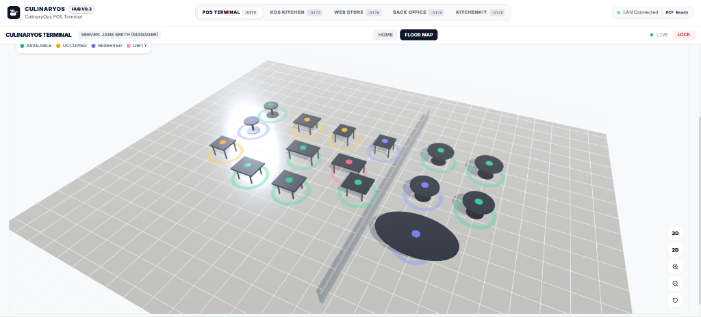
  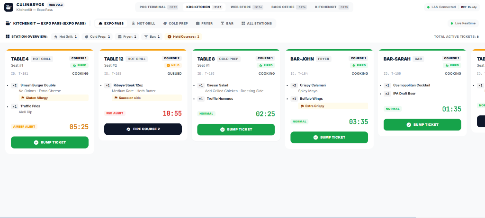
</p>
<p align="center">
  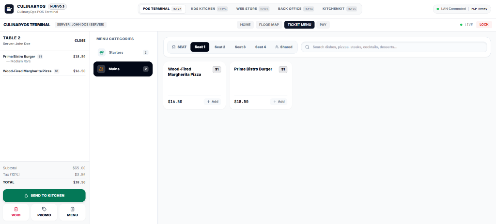
  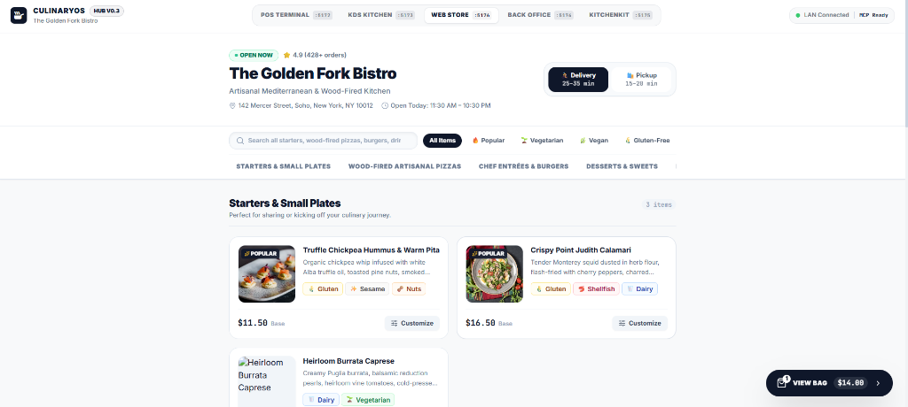
</p>

<p align="center"><em>3D Spatial Floor Plan · Real-Time Kitchen Display (KitchenKit) · Multi-Seat POS Terminal · Online Ordering Storefront</em></p>

> Not a cheaper Toast clone. A **protocol restaurant**: kitchen state is a versioned contract that operators *and* AI agents can drive — with sovereign data and a closed economic loop (recipe → fire → waste/cost).

---

## What is CulinaryOS?

CulinaryOS is a **complete, MIT-licensed restaurant operating system** built as a TypeScript monorepo. It covers every surface of a modern food-service operation:

- **POS Terminal** — PIN-authenticated, offline-first, multi-tender (card, tap, QR, cash, comp)
- **Kitchen Display System (KDS)** — real-time ticket aging, station routing, multi-course hold/fire
- **Admin Back-Office** — menu builder, 86ing, staff PINs, pantry par levels, purchase orders
- **Online Storefront** — guest ordering with FDA Top 9 dietary filtering and cart checkout
- **Unified API** — Hono on Node.js 20; single source of truth for orders, inventory, ops, and payments
- **MCP Agent Layer** — 9 specialized Model Context Protocol servers that let AI agents operate on live restaurant state

All surfaces share a single Supabase PostgreSQL backend with Row Level Security (RLS) enforcing strict multi-tenant isolation. The AI layer is **strictly additive** — every core operation works identically with or without an Anthropic API key.

---

## Architecture

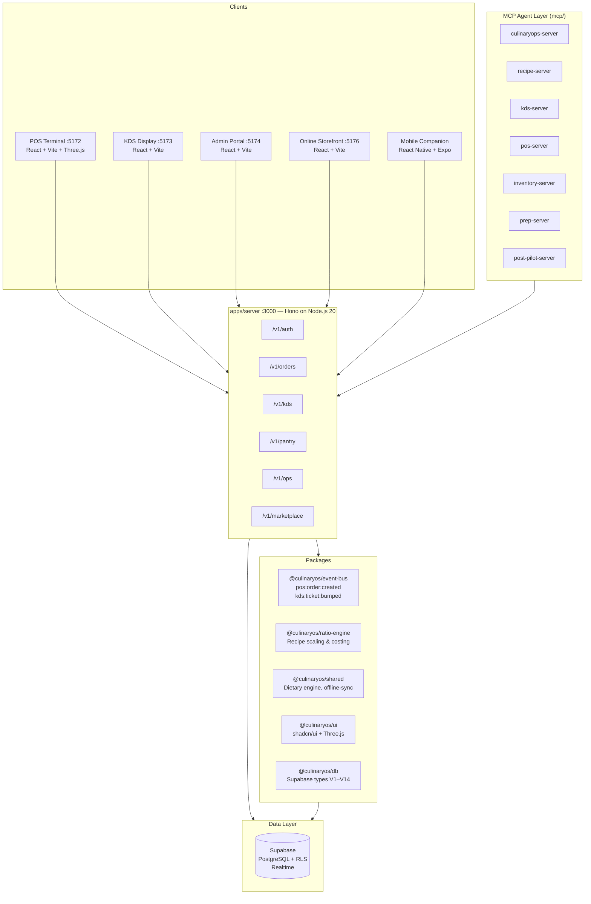

---

## Why CulinaryOS?

| Feature | Legacy Restaurant SaaS | CulinaryOS |
|---|---|---|
| **Architecture** | Closed proprietary silos (+ bolted-on chat) | **Agent-operable OS** — MCP tools on live tickets, inventory, waste, and food-cost |
| **API & Contracts** | Proprietary walled gardens | **Open contracts** — standard order fire spine, RLS multi-tenancy, `extension_template/` |
| **Economics** | Separate POS and inventory software | **Closed-loop economics** — fire automatically emits pantry deduction & `plate_economics` |
| **Data Sovereignty** | Vendor lock-in | **Operator-owned PostgreSQL** (Supabase / self-hosted PostgreSQL) |
| **Design & Ergonomics** | Clunky legacy interfaces | **Modern shadcn/ui suite + Three.js 3D spatial floor map** with real-time status glow halos |
| **Dietary Safety** | Basic static ingredient text | **FDA FASTER Act Top 9 allergen engine** + cross-contact matrix & safe substitution paths |
| **Operations Review** | Expensive manual consultants | **Built-in AI Operations Manager agent** + daily workflow audits (`pnpm ops:audit`) |
| **Service Resilience** | AI or cloud outage halts operation | **AI is additive & offline-first** — POS/KDS continue running offline with delta queues |
| **Cost** | Per-terminal licensing + revenue share | **Free forever (MIT)** — pay only your own infrastructure and Stripe processing fees |

---

## Surfaces & Applications

| Package | Port / Target | Role |
|---|---|---|
| `apps/server` | `:3000` | Unified Hono API — authentication, orders, KDS, pantry, payments, ops, **settings**, marketplace |
| `apps/pos` | `:5172` | POS terminal (PIN login, 2D/3D floor map, ESC/POS hardware printer hub, live text scaling) |
| `apps/kds` | `:5173` | Kitchen Display System (real-time tickets, station filters, course hold/fire, TV 140% mode) |
| `apps/admin` | `:5174` | Admin portal — menu editor, staff PINs, pantry par levels, **system settings & kitchen routing** |
| `apps/kitchenkit` | `:5175` | KitchenKit — Recipe catalog, station prep planner, par levels, vendor management, shelf life |
| `apps/web` | `:5176` | Online ordering storefront (FDA Top 9 dietary filtering, cart customization, instant checkout) |
| `apps/ops` | `:5177` | CulinaryOps — Real-time food cost analytics, waste logging, labor %, and vendor performance |
| `apps/recipeos` | `:5178` | RecipeOS — Next.js recipe vault, ratio scaling engine, unit conversions, and shopping list |
| `packages/ui` | Shared | Centralized **shadcn/ui** design system (`components.json`, Radix UI primitives, Three.js 3D canvas) |
| `packages/shared` | Shared | Unified settings engine, dietary filter engine, printer driver, offline-sync delta engine |
| `packages/prep-engine` | Shared | Recipe prep task management and batch requirement calculations |
| `packages/food-cost-engine` | Shared | Pure functions for actual vs theoretical food cost variance calculations |
| `packages/waste-engine` | Shared | Kitchen waste summarization and top cost-leakage analysis |
| `packages/labor-engine` | Shared | Shift labor hours, wage summaries, and labor cost percentage calculations |
| `packages/pdf-tools` | Shared | Print-ready PDF menu export (`jspdf`) and table QR code generators |
| `packages/template-engine` | Shared | Multi-concept restaurant website and menu template token engine |
| `packages/seo-tools` | Shared | Schema.org JSON-LD structured data generators for restaurant menus and locations |
| `packages/asset-tools` | Shared | OpenGraph banner generator (`satori`), favicons, and palette extractors |
| `mcp/` | Extension | 9 Model Context Protocol servers + Python Post-Pilot loyalty agent |


---

## MCP AI Agent Layer

CulinaryOS ships 9 Model Context Protocol servers that expose live restaurant operations to AI agents (Claude Desktop, Cursor, Windsurf, any MCP-compatible client):

| Server | Entrypoint | Key Tools |
|---|---|---|
| `culinaryops-server` | `mcp/src/culinaryops-server.ts` | `get_ops_summary`, `log_waste`, `get_plate_economics`, `analyze_food_cost` |
| `culinaryops-hub-live` | `mcp/src/culinaryops-hub-live.ts` | Live ops dashboard — shift performance, cover counts |
| `recipe-server` | `mcp/src/recipe-server.ts` | `get_recipe`, `scale_recipe`, `list_recipes`, `create_recipe` |
| `inventory-server` | `mcp/src/inventory-server.ts` | `get_inventory_levels`, `log_audit_count`, `update_pantry_item` |
| `kds-server` | `mcp/src/kds-server.ts` | `fetch_kds_tickets`, `bump_kds_ticket`, `fire_course` |
| `pos-server` | `mcp/src/pos-server.ts` | `create_order`, `send_order_to_kitchen`, `apply_loyalty_points` |
| `prep-server` | `mcp/src/prep-server.ts` | `generate_prep_list`, `get_prep_list`, `project_batch_requirement` |
| `post-pilot-server` | `mcp/src/post-pilot-server.ts` | `get_loyalty_balance`, `generate_postcard`, `send_loyalty_campaign` |

See [`mcp/README.md`](mcp/README.md) for Claude Desktop configuration and full tool reference.

---

## Extension Marketplace

CulinaryOS ships a built-in extension marketplace at `/v1/marketplace`. Any operator can browse, install, and manage first-party and partner extensions — all without requiring an active LLM:

```bash
# List all available extensions
GET /v1/marketplace/extensions

# Install an extension for the current session/tenant
POST /v1/marketplace/extensions/com.axomai.culinaryos/install

# Check AI layer availability
GET /v1/marketplace/ai/status
```

### Built-in Extensions

| Extension | ID | Category | Description |
|---|---|---|---|
| RecipeOS Bridge | `com.culinaryos.ext.recipeos` | Recipes | Recipe ratio scaling & baker's percentage engine |
| KitchenKit | `com.culinaryos.ext.kitchenkit` | KDS | Multi-course routing, station prep planning |
| CulinaryOps | `com.culinaryos.ext.culinaryops` | Operations | Waste diagnostics, food costing, plate economics |
| Plated | `com.culinaryos.ext.plated` | Inventory | Advanced pantry tracking and reorder automation |
| Post-Pilot | `com.culinaryos.ext.post-pilot` | Marketing | Loyalty campaigns and postcard automation |
| Voice Ordering | `com.culinaryos.ext.voice` | POS | Voice-driven order entry assistant |
| Hardware Agent | `com.culinaryos.ext.hardware` | Hardware | Receipt printers, cash drawers, KDS bump bars |

### Optional AI Layer (Claude)

When `ANTHROPIC_API_KEY` is set, optional AI-powered endpoints activate:

| Endpoint | Purpose | Fallback (no key) |
|---|---|---|
| `POST /v1/marketplace/ai/ops-insight` | AI shift performance analysis | Plain metric summary |
| `POST /v1/marketplace/ai/prep-plan` | AI morning prep checklist | Cover count + low stock list |
| `POST /v1/marketplace/ai/loyalty-message` | AI loyalty postcard copy | Template message |

**AI is strictly additive** — all core restaurant operations (PIN login, order fire, KDS bump, pantry deduct, tender) function identically with or without the Anthropic API.

---

## Quick Start (Local Demo Mode)

Run the entire system locally in under 30 seconds with **zero database setup and zero external API keys**:

### Prerequisites

- [Node.js 20+](https://nodejs.org/)
- [pnpm 9+](https://pnpm.io/installation) (`npm install -g pnpm`)

### Boot

```bash
# 1. Clone repository and install dependencies
git clone https://github.com/ShadowWalkerNC/CulinaryOS.git
cd CulinaryOS
pnpm install

# 2. One-command turnkey boot (launches POS, KDS, Admin, Web, and API)
pnpm quickstart
```

*(On Windows you can also double-click `quickstart.bat`, or run `./quickstart.sh` on macOS/Linux).*

**Interactive walkthrough:** See [`QUICKSTART.md`](QUICKSTART.md).

### Demo Credentials

| Surface | URL | Credential |
|---|---|---|
| **POS Terminal** | [localhost:5172](http://localhost:5172) | Server PIN: `1234` · Manager PIN: `5678` |
| **Kitchen Display (KDS)** | [localhost:5173](http://localhost:5173) | No login required |
| **Admin Portal** | [localhost:5174](http://localhost:5174) | No login required |
| **Online Storefront** | [localhost:5176](http://localhost:5176) | No login required |
| **Unified Hono API** | [localhost:3000](http://localhost:3000) | `X-Tenant-Id: 00000000-0000-0000-0000-000000000001` |

In offline/demo mode, POS serves a sample menu, buffers transactions to localStorage, and communicates with the in-memory mock kitchen store on the API. POS and KDS do **not** share live state in demo mode — use a live Supabase backend for cross-app POS→KDS order flow.

---

## Operations Consultant & Daily Audits

CulinaryOS includes an autonomous **Restaurant Operations Manager & Consultant** framework for continuous review of hospitality workflows:

```bash
# Run daily operations audit & generate report
pnpm ops:audit

# View the latest operational critique
cat docs/DAILY_OPERATIONS_REPORT.md
```

The audit evaluates speed-of-service, touchscreen ergonomics, KDS course hold/fire timers, FDA Top 9 allergen classifications, and shared fryer cross-contact risks, and generates targeted daily operational questions for engineering refinement.

---

## Connecting to Live Supabase Backend

To enable multi-device sync, PostgreSQL Row Level Security (RLS), and live Supabase Realtime:

1. Provide valid keys in `.env`:
   ```env
   SUPABASE_URL=https://your-project.supabase.co
   SUPABASE_ANON_KEY=eyJ...
   SUPABASE_SERVICE_ROLE_KEY=eyJ...
   AUTH_RELAXED=false
   ```
2. Apply database migrations:
   ```bash
   npx supabase db reset
   ```
3. Seed default tenant, menu, and staff PINs:
   ```bash
   pnpm seed
   ```
4. Start the stack — POS, KDS, Admin, and MCP agents will now operate on your live database with strict tenant isolation.

See [`docs/DEPLOYMENT.md`](docs/DEPLOYMENT.md) for full Docker Compose and cloud hosting options.

---

## Quality & Testing Gate

CulinaryOS enforces strict quality gates across the monorepo:

```bash
# Run complete test suite (32 test suites, 110+ tests)
node ./scripts/run-all-tests.cjs

# Run workspace-wide typecheck (18 tasks across all packages — 0 errors)
pnpm run typecheck

# Build all packages and applications
pnpm run build

# Run production readiness preflight doctor
pnpm doctor
```

> **Note on lint:** `pnpm run lint` is currently non-functional (eslint configs pending). Use `pnpm typecheck` as the static analysis gate.
>
> **Note on `pnpm test`:** The Turborepo root `#test` task has a known recursive-invocation issue. Use `node ./scripts/run-all-tests.cjs` or `bun test tests/server/` directly.

---

## Repository Structure

```
CulinaryOS/
├── apps/
│   ├── server/          ← Unified Hono API (orders, KDS, pantry, ops, payments)
│   ├── pos/             ← POS terminal (React / Vite / shadcn / Three.js)
│   ├── kds/             ← Kitchen Display client (React / Vite)
│   ├── admin/           ← Admin / pantry portal (React / Vite)
│   └── web/             ← Online ordering storefront (React / Vite)
├── packages/            ← shared, event-bus, auth, db, ui, config, ratio-engine
├── mcp/                 ← 9 MCP servers — AI agent tool layer
├── extensions/          ← First-party extension manifests
├── extension_template/  ← Public contract for third-party extensions
├── mobile/              ← React Native + Expo companion (stub)
├── supabase/            ← Migrations + seeds (V1–V14)
├── cli/                 ← Operator CLI tool
├── tests/               ← Integration + e2e tests
├── docs/                ← Technical documentation
├── scripts/             ← quickstart, seed, doctor, simulate, ops-audit
├── docker-compose.yml   ← Production container build
├── pnpm-workspace.yaml  ← Monorepo workspace config
├── turbo.json           ← Turborepo pipeline config
└── .env.example         ← All required env vars
```

---

## Screenshots

> All screenshots captured live from the running application.

### 3D Spatial Floor Plan & Table Management
<p align="center">
  
</p>

### Kitchen Display System (KitchenKit — Station Routing)
<p align="center">
  
</p>

### POS Terminal — Multi-Seat Ticket Menu
<p align="center">
  
</p>

### Online Customer Storefront
<p align="center">
  
</p>

### Additional Screens
<p align="center">
  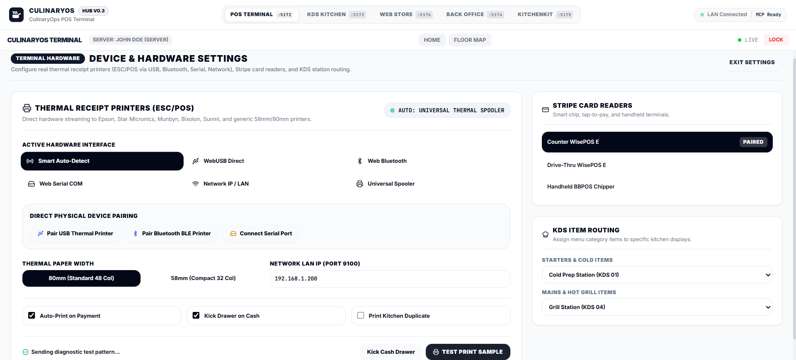
  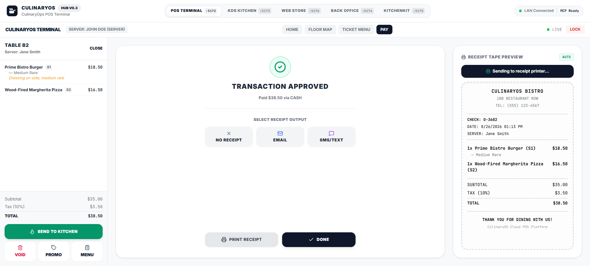
  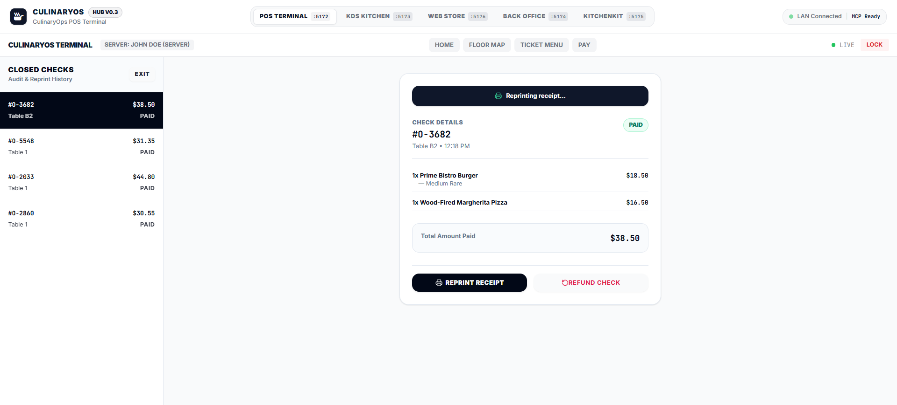
</p>
<p align="center">
  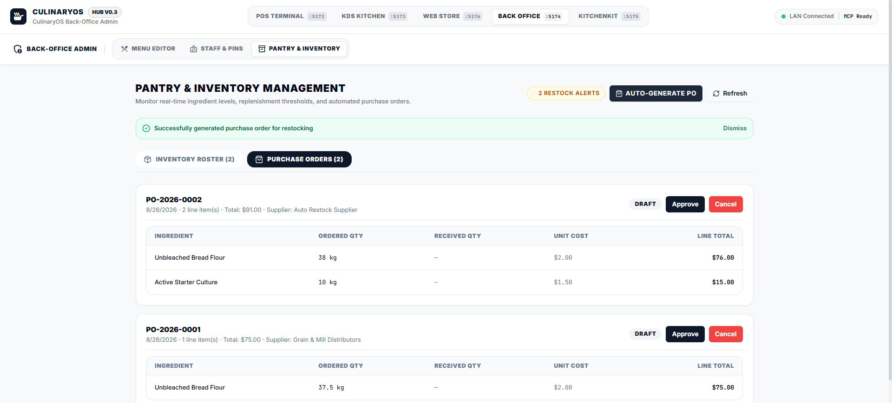
  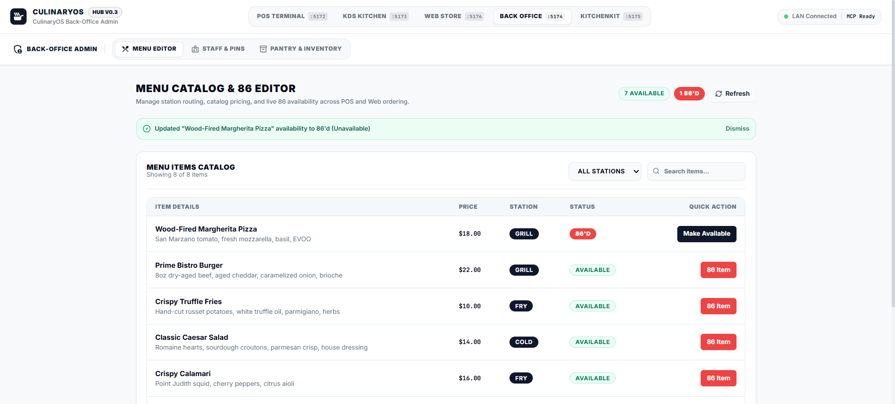
  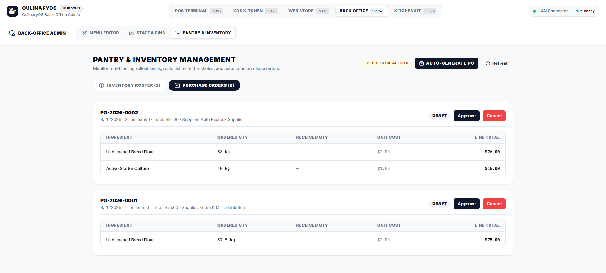
</p>

---

## Contributing

We welcome contributions! Please read [`CONTRIBUTING.md`](CONTRIBUTING.md) before opening a PR.

- **Branch naming:** `feature/[module]-[description]` · `fix/[module]-[issue]` · `docs/[scope]`
- **Commit format:** [Conventional Commits](https://www.conventionalcommits.org/) — `feat(pos): ...`, `fix(kds): ...`, `docs(readme): ...`
- **Non-negotiable:** every database query must be scoped by `tenant_id` / RLS. Unscoped queries are rejected.

---

## Community & Support

- **Bug reports & feature requests:** [GitHub Issues](https://github.com/ShadowWalkerNC/CulinaryOS/issues)
- **Questions & discussion:** [GitHub Discussions](https://github.com/ShadowWalkerNC/CulinaryOS/discussions)
- **Architecture & API docs:** [`docs/`](docs/)
- **Extension development:** [`extension_template/`](extension_template/)

---

## License

[MIT](./LICENSE) — Own your stack. Built with TypeScript, React, Vite, Three.js, Radix UI, Hono, Supabase, Turborepo, and Model Context Protocol (MCP).
