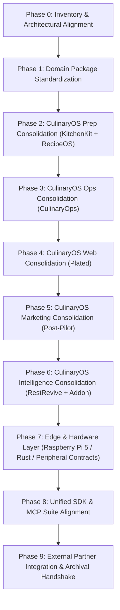

# CulinaryOS Monorepo Consolidation — Master Plan

> **Document Version:** 1.0.0
> **Status:** Active Execution Plan
> **Strategy:** Phased, Safe, Zero-Regression Migration

This document details the step-by-step phased execution plan to consolidate the restaurant technology product family into the unified **CulinaryOS** monorepo.

---

## 1. Principles of Consolidation

1. **Safety & Zero-Regression First:** Existing POS, KDS, Admin, payments, and offline-durable transaction queues must NEVER be broken or regressed during consolidation.
2. **One Monorepo, Strong Domain Boundaries:** Code is structured by bounded context. No circular imports, no monolithic spaghetti packages, no bypassing API/service layers.
3. **No Direct Database Bypassing:** Apps and services must never directly manipulate another domain's raw database tables without going through proper domain services or events.
4. **Offline Resilience Standard:** Core hospitality operations (POS order entry, ticket firing to KDS, offline card authorization queues, local receipt printing) must continue uninterrupted during internet outages.
5. **Vendor-Neutral AI:** Machine learning and generative AI capabilities must be swappable via abstract provider interfaces (`ProviderAdapter`). Business rules must never hardcode vendor SDKs.

---

## 2. Phased Execution Roadmap

---

## 3. Phase Details & Deliverables

### Phase 0: Inventory & Architectural Alignment (COMPLETED)
- **Actions:**
  - Audited CulinaryOS root, packages, apps, services, and modules.
  - Audited all candidate repositories: KitchenKit, RecipeOS, CulinaryOps, Post-Pilot, Plated, RestRevive-AI, and ShorelineOps.
  - Established explicit boundaries for non-absorbed projects (ShorelineOps, MuseLab, ForgeSatchel, JOSH).
  - Authored `docs/MIGRATION_MATRIX.md` and `docs/CONSOLIDATION_PLAN.md`.

### Phase 1: Domain Package Standardization
- **Goal:** Unify and formalize core domain contracts across `packages/`.
- **Key Work:**
  - Standardize `@culinaryos/prep` and `@culinaryos/recipes` package boundaries.
  - Standardize `@culinaryos/ops` (`food-cost-engine`, `labor-engine`, `waste-engine`).
  - Standardize `@culinaryos/template-engine`, `@culinaryos/asset-tools`, `@culinaryos/pdf-tools`, `@culinaryos/seo-tools`.
  - Ensure all packages expose strict ESM exports with TypeScript `.d.ts` declarations.
- **Verification:** `pnpm run typecheck` across all packages with zero errors.

### Phase 2: CulinaryOS Prep Consolidation (KitchenKit + RecipeOS)
- **Goal:** Unify batch prep planning and recipe vault into **CulinaryOS Prep**.
- **Key Work:**
  - Merge RecipeOS recipe vault models, yield calculations, and allergen profiles into `@culinaryos/recipes`.
  - Integrate KitchenKit's ratio engine and mise en place generator into `@culinaryos/prep`.
  - Unify UI inside `apps/prep` (retaining `apps/kitchenkit` alias during transition).
  - Connect prep completion events to the core inventory depletion engine (`prep.task.completed` -> decrements raw inventory).
- **Verification:** Prep batch calculation unit tests, UI smoke test, `pnpm build`.

### Phase 3: CulinaryOS Ops Consolidation (CulinaryOps)
- **Goal:** Fully embed prime cost intelligence, labor targets, and waste logging into **CulinaryOS Ops**.
- **Key Work:**
  - Unify `apps/ops` with shared UI design tokens (`@culinaryos/ui`).
  - Implement actual vs. theoretical food cost calculation connecting POS sales to recipe batch depletion.
  - Hardcode FLSA tip credit rules and manager exclusion gates into `@culinaryos/labor-engine`.
  - Integrate waste logs with supplier credit memo requests.
- **Verification:** Labor and food cost mathematical proofs, test runner pass.

### Phase 4: CulinaryOS Web Consolidation (Plated)
- **Goal:** Transform `apps/web` into the unified public site, online guest commerce, and restaurant website builder.
- **Key Work:**
  - Migrate Plated's 8 restaurant themes (`templates/*`) into `@culinaryos/template-engine`.
  - Integrate Sharp/Satori image asset generation into `@culinaryos/asset-tools`.
  - Integrate Schema.org `Restaurant` markup generator into `@culinaryos/seo-tools`.
  - Integrate jsPDF physical menu generation into `@culinaryos/pdf-tools`.
  - Connect public online ordering to `apps/server` order creation endpoint.
- **Verification:** Static Astro/Vite generation test, QR menu PDF output test.

### Phase 5: CulinaryOS Marketing Consolidation (Post-Pilot)
- **Goal:** Absorb Post-Pilot's autonomous marketing, brand guardrails, and campaign scheduling into **CulinaryOS Marketing**.
- **Key Work:**
  - Migrate Post-Pilot Python core into `services/marketing-python`.
  - Migrate 5 operational skills (`brand_guard`, `event_campaign`, `review_reply`, `special_post`, `weekly_plan`).
  - Port REST client normalizer to consume CulinaryOS menu and specials endpoints directly.
  - Expose campaign planning studio inside `apps/marketing`.
- **Verification:** Python pytest test suite pass, FastAPI health check, campaign generation smoke test.

### Phase 6: CulinaryOS Intelligence Consolidation (RestRevive + Addon)
- **Goal:** Establish the vendor-neutral AI runtime and operational skill registry in **CulinaryOS Intelligence**.
- **Key Work:**
  - Migrate 12 operational skills from `culinaryos-intelligence` into `intelligence/skills/`.
  - Migrate 6 role agents into `intelligence/agents/`.
  - Port RestRevive's financial revival and anomaly detection algorithms into `intelligence/diagnostics/`.
  - Create `ProviderAdapter` abstraction supporting Claude, Gemini, OpenAI, and local LiteRT/Ollama.
  - Implement human-in-the-loop policy and approval engine (`approval.list`, `approval.decide`).
- **Verification:** Skill runner unit tests, adapter mock test, MCP stdio test.

### Phase 7: Edge & Hardware Layer (Raspberry Pi 5 / Rust / Peripheral Contracts)
- **Goal:** Formalize local hardware peripheral drivers, offline order continuity, and edge node contracts.
- **Key Work:**
  - Create peripheral contracts in `hardware/drivers/` (ESC/POS thermal printer, RJ11 drawer kick, scales, BLE temperature probes).
  - Define Raspberry Pi 5 / CM5 local edge runner in `hardware/raspberry-pi/`.
  - Establish Rust low-level micro-daemon for raw serial/USB communication where high performance and crash-free reliability are needed.
  - Implement local-to-cloud bidirectional sync queue using HMAC-signed delta envelopes.
- **Verification:** Hardware loopback test, offline queue durability test under network drop.

### Phase 8: Unified SDK & MCP Suite Alignment
- **Goal:** Expose the public `@culinaryos/sdk` and standard restaurant MCP tool server.
- **Key Work:**
  - Expose intuitive SDK methods: `culinary.menu.get()`, `culinary.orders.create()`, `culinary.inventory.adjust()`, `culinary.prep.tasks.list()`, `culinary.analytics.query()`.
  - Expose standard MCP tools: `restaurant.get`, `menu.get`, `orders.list`, `inventory.get`, `inventory.adjust`, `prep.list`, `recipes.get`, `marketing.generate`, `analytics.get`.
  - Validate role-based permissions on every SDK and MCP invocation.
- **Verification:** SDK end-to-end integration tests, MCP Inspector test.

### Phase 9: External Partner Integration & Archival Handshake
- **Goal:** Formalize ShorelineOps integration client and mark source repositories as deprecated/read-only.
- **Key Work:**
  - Author `@culinaryos/integrations/shoreline` client with HIPAA-safe boundaries.
  - Update READMEs in absorbed repositories pointing to `CulinaryOS`.
  - Mark old GitHub repositories as read-only.
- **Verification:** Complete monorepo build, comprehensive test suite pass.

---

## 4. Rollback & Contingency Plan

If any consolidated package introduces breaking regressions into frontline service (POS, KDS, API):
1. **Isolated Module Revert:** Because each module is bounded within its own directory and package namespace, changes can be rolled back on a per-commit basis using `git revert` without impacting sibling domains.
2. **Feature Gating:** New capabilities (autonomous marketing posts, AI suggestions, background batch prep decrements) remain disabled by default behind feature flags until verified in staging.
3. **Database Guardrails:** New tables and schemas must never alter or drop active POS/KDS tables (`orders`, `order_items`, `kitchen_tickets`, `payments`). All schema changes are strictly additive.
