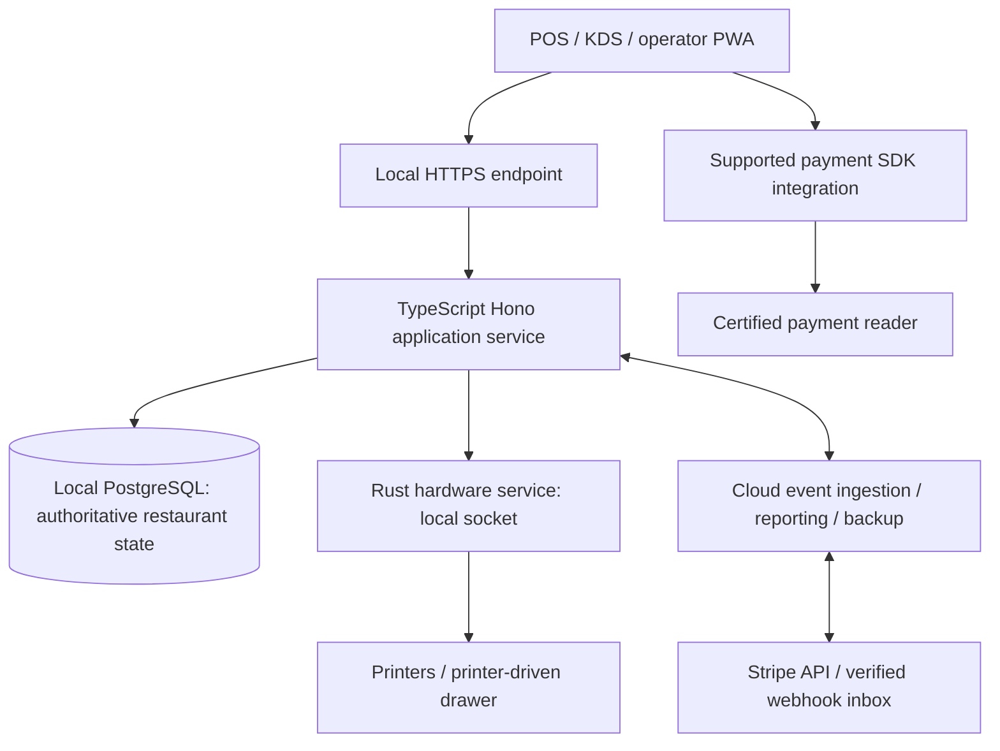

# CulinaryOS hardware and software integration plan

Date: 2026-10-02. Status: planned; physical compatibility and combined runtime acceptance NOT RUN.

## Objective and scope

Deliver a supported restaurant appliance: Raspberry Pi 5 reference hub, existing TypeScript/PWA POS and KDS, local Hono/PostgreSQL, bounded Rust hardware service, and controlled cloud synchronization. This answers R8/P7 hardware and recovery requirements and extends the existing full-service split-check/coursing pilot. No application rewrite or custom payment hardware. Planning does not authorize purchases or certify devices.

Read with ARCHITECTURE_RESILIENCE_PLAN.md, POS_PILOT_CORRECTNESS_SPEC.md, ANTIGRAVITY_MUSE_HANDOFF_2026-10-02.md and RESILIENCE_OPERATIONS.md. Preserve the existing H0–H6 work. Ledger reports H0, H1 and H2b locally complete; H2a is assigned to Muse. These are historical reports, not a freshly validated combined baseline.

## Target architecture and ownership of data

The payment SDK branch is conditional on the selected integration: a server-driven online path can use the cloud gateway; offline card support requires a supported native SDK boundary. Neither path sends raw card data through the hub.

- One commissioned hub per restaurant is the writer for active orders, checks, cash, kitchen state and hardware jobs. Local restricted-role PostgreSQL is the system of record for those domains. Browser queues contain pending commands, not settled truth.
- Railway/cloud PostgreSQL remains the target for cloud services, reporting projections and durable provider inboxes. Do not enable simultaneous cloud and hub writers for the same operational aggregate. This changes deployment topology, not the shared domain rules or fresh-database/no-legacy-import decision.
- Stripe is authoritative for provider payment outcomes. The cloud durably accepts verified webhooks and forwards deduplicated provider events to the hub. A hub outage delays local reconciliation; it does not justify discarding webhooks or collecting a second payment.
- Cloud menu/config changes are versioned commands applied and acknowledged by the hub. Cloud interfaces show stale/offline status; no last-write-wins merging of money or checks. Remote orders remain pending until hub acceptance; define rejection/expiry before enabling that channel.
- Initial pilot has no automatic failover. Replacement is an operator ceremony: isolate/fence old hub, restore known state, reconcile browser queues and provider outcomes, issue a new hub epoch and credentials. An old hub must not reconnect as a writer. Internet outages do not transfer authority to cloud.
- Keep existing `/v1/*` contracts, `PATCH /v1/orders/:id/send`, and `pos:order:created` to `kitchen_tickets`. Rust executes hardware operations; it never owns taxes, splits, tenders, staff permissions or kitchen business transitions.

## Reference kit and compatibility matrix

All selections below are candidates until exact SKU, firmware and acceptance evidence are recorded. Do not purchase from a generic model-family description.

| Component | Reference target | Integration / prerequisite | Acceptance |
| --- | --- | --- | --- |
| Hub | Pi 5, initially 8GB, 64-bit supported Linux | ARM64 Node runtime, PostgreSQL, Rust binary; pin tested versions | Actual ARM64 install/build, combined load and reboot |
| Storage | SSD, NVMe with compatible adapter or verified USB SSD | Match enclosure, cooler, power budget and boot support; no SD-only production database | Boot, sustained writes, full disk, sudden power loss and restore |
| Power / cooling | Appropriate Pi supply, active cooling, UPS | UPS also protects essential switch/AP/router; measure complete load | No throttling at expected ambient; tested runtime/shutdown |
| POS | One Android/Chromium device first; iPad/Safari next | Trusted local HTTPS; PWA uses server hardware commands | Install/cache, login, touch, reconnect, quota and session recovery |
| KDS | One supported tablet or kiosk screen/computer | Same local origin/API; durable catch-up | Send/fire/bump, reconnect cursor, restart, duplicate suppression |
| Receipt printer | First candidate: Ethernet Epson TM-m30III | Exact interface SKU and documented print/status protocol | Layout, cut, paper-out, reconnect and ambiguous-send handling |
| Drawer | Exact printer-compatible drawer and cable | Manufacturer-confirmed voltage, pinout and pulse; through printer | Authorized cash/no-sale only, denial and audit; no duplicate pulse retry |
| Alternate printer | Star TSP100IV family, separate later adapter | StarPRNT/CloudPRNT as applicable; never assume ESC/POS | Same failure suite on exact model/firmware |
| Kitchen printer | Optional impact printer | Exact protocol and station routing | Heat placement, legibility, dedupe and outage recovery |
| Payment reader | Stripe-supported exact reader for country/account | Decide online-only or native-SDK offline path before purchase | Real test-mode Connect routing, decline, timeout, refund, reconnect |
| Network | Ethernet hub/printers; Wi-Fi clients | POS subnet separated from guest Wi-Fi; DHCP reservations/local DNS | WAN/DNS loss, AP restart, guest denial, reader connectivity |
| Recovery | Spare compatible hub, encrypted separate backup target | Provisioning, key rotation, fencing and restore instructions | Replacement rehearsal with financial/queue reconciliation |

Compute Module 5 and custom carrier/enclosure follow appliance acceptance. Revalidate power, storage, thermals, interfaces, EMC/electrical/radio obligations and manufacturing test. Pi 5 certification does not certify a modified finished product. Scales/sensors/scanners/labels are later feature slices; trade scales require applicable legal metrology validation.

## Compatibility gaps to close

| Finding | Evidence / classification | Required change |
| --- | --- | --- |
| Browser network printing is absent in the inspected print path | Confirmed source gap: `apps/pos/src/lib/hardware-printer.ts` `printReceipt` handles USB/Bluetooth/Serial then browser printing; network config is not a TCP adapter | Add authenticated application hardware jobs; no browser raw TCP requirement |
| Drawer fallback reports success without hardware transport | Confirmed source gap: `kickCashDrawer` returns system success with no USB/Serial device | Return unavailable/unknown honestly; do not accept UI success as actuation evidence |
| Catalog claims certification and uniform protocols | Confirmed wording gap: `cli/src/commands/hardware.ts` calls BOM certified and groups Star/Epson as ESC/POS | Evidence-backed model/protocol registry with candidate/tested/supported states; correct associated public claims |
| Plain LAN HTTP is insufficient for PWA service workers | Documented platform constraint; actual local deployment not tested | Trusted HTTPS with stable origin; offline local DNS; test certificate renewal/expiry and tablet trust |
| Pure PWA/Pi Rust path is insufficient for promised offline cards | Stripe current offline availability table lists native SDK integrations | Online-only card baseline plus explicit outage policy; if offline cards mandatory, add supported Android/iOS native payment shell/module and revalidate before hardware lock |
| Local hub plus cloud changes authority topology | Architecture delta, not implemented | Versioned event replication and writer fencing; prohibit dual writable operational databases |
| Generic compatibility claims exceed evidence | Current desktop package is React/Vite, not a native hardware runtime | Validate exact browser/OS matrix and ARM64 runtime dependencies; no universal-device claim |

## Interface and security contracts

1. PWA calls the same HTTPS origin for application API and static assets. Use a controlled domain resolving locally with a publicly trusted certificate; pre-provision certificates and monitor expiry. Offline certificate expiry remains a blocking operational fault with a renewal/recovery procedure. Managed-device private CA is an alternative, not an invisible installation requirement. Do not change origins casually: browser queues and sessions are origin-scoped. Avoid mixed content and cloud-page-to-LAN dependency for core operation.
2. Application validates human identity, tenant, enrolled device, role, target and business preconditions. Use existing token-derived RLS and restricted runtime role; migration credentials separate. Protect session endpoints against CSRF as appropriate to chosen auth transport. Never trust tenant headers or LAN presence as authority.
3. Versioned hardware envelope: schema version, job UUID, restaurant/device/target IDs, operation, authorized receipt reference, fingerprint and correlation ID. Serialize monetary values as validated integer cents within safe cross-language bounds; define timestamps/enums/errors through shared schemas and golden contract fixtures. Reject incompatible major versions and altered duplicate payloads.
4. Rust uses a permission-restricted local Unix socket, dedicated Linux service identity and narrowly granted device access. No public unauthenticated daemon, arbitrary destination host/port, arbitrary bytes from browsers, or general shell execution. Registered destinations only; cap queue sizes/payloads and redact sensitive diagnostics.
5. Authoritative PostgreSQL outbox stores hardware jobs transactionally. Rust claims bounded jobs through the application service, with lease/fencing and per-target ordering. Job states distinguish queued, claimed, sent, confirmed where supported, failed and unknown. Crash after send is unknown unless the device offers reliable dedupe/status evidence. No exactly-once physical printing promise; audited reprint gets a new job linked to the original. Never blindly retry drawer pulses.
6. Sync is authenticated outbound communication with event UUID, aggregate version, hub epoch, fingerprint, retry and durable cursor. Persist before acknowledgement, reject duplicate-ID/different-payload, handle gaps and backpressure. Cloud restoration cannot reset local money history. Define retention, backup encryption and restore guarantees before pilot.
7. Linux supervision starts DB, API and bridge in order; `/ready` distinguishes DB readiness from optional printer failure. A failed printer must not silently disable order service. Disable only unavailable operations and surface actionable state. Browser client-to-hub loss queues only permitted commands; display pending status and capacity limits. Never queue card settlement.
8. Signed release manifests, pinned ARM64 dependencies, maintenance-window updates, prior compatible release retention and append-only migrations. Code rollback is allowed only within verified schema compatibility; never roll back data by deleting financial records. Validate PWA/API/bridge old-new combinations and prevent incompatible cache activation during an open check.
9. Device clock/NTP and WAN-loss clock behavior are tested; server time defines business-day transitions. Backup coverage includes DB, required media/config, device registry and safe secret reprovisioning. Offline staff revocation needs local enforcement; pending cloud revocation is visibly delayed until synchronization.

## PR-sized execution stages

Estimates are planning ranges, not token budgets. Every slice needs ledger ownership before edits. No new work takes Muse's active H2a files. Split a stage into separate feature PRs when necessary; all new runtime code stays in monorepo packages/apps. No jobs dispatched by this plan.

| Stage / requirement | Planned files/systems | Dependency | Exit evidence | Est. tokens / rollback |
| --- | --- | --- | --- | --- |
| A0 evidence registry and contract freeze / R8 | New docs hardware registry; existing CLI hardware, POS printer adapter, related tests; shared versioned contract schemas | Reconcile active claims; retain H0–H6 | Catalog honest; model/protocol matrix; unsupported transport denies; payment path documented | 10–20k; disable new device path, preserve old explicit manual printing |
| A1 ARM64 appliance packaging / R7–R8 | New `apps/appliance/` packaging, service units/proxy config, package manifests; necessary turbo tasks; docs | Existing native integration baseline; exact kit | Reproducible ARM64 build; restrictive services; boot, HTTPS, DNS, clock, disk-full | 15–25k; prior tested image/config, preserve data |
| A2 local authority and cloud relay / R3–R5 | Existing server/db outbox and verified provider inbox; new sync module and tests; cloud ingestion; operator CLI | H2a/H3/H4 accepted; topology contract frozen | WAN-loss service, duplicate/gap/reorder, stale cloud, epoch fencing and reconciliation | 20–40k per relay/provider/fencing slice; pause sync/remote writes, preserve local journal |
| A3 Rust printer bridge / R8 | New `apps/device-agent/` Cargo package + workspace wrapper; shared hardware contracts; server hardware jobs; CLI diagnostics; printer UI adapter | A0/A1, accepted durable outbox | Exact printer job/status handling, lease fencing, physical failure suite, schema fixtures | 20–35k; disable bridge, retain pending/unknown jobs and audited fallback |
| A4 drawer permissions / R6–R8 | Bridge drawer adapter, application authorization/audit, POS no-sale/cash flow, CLI parity/tests | A3; exact electrical pairing | Authorized open, manager policy, denial, crash/unknown handling and audit | 10–20k; disable automatic drawer, approved manual procedure |
| A5 payment integration / R5 | Existing payments/provider inbox/POS/CLI; native payment shell only if required | H4, selected country/reader/SDK; A2 | Connect/account/currency binding, tips/refunds/split tender, ambiguous outcomes; supported offline path separately proved | 20–40k per online/native/reconciliation slice; disable collection, reconcile pending intents |
| A6 browser/KDS/full-service acceptance / R3–R6 | Existing POS/KDS/shared queue and CLI; browser/device evidence | H3/H5, A1–A5 | Exact browsers, A01–A16, splits during production, course dedupe, queue persistence and old-client compatibility | 15–30k per workflow; feature containment, preserve check/tender/course records |
| A7 capacity and recovery / R7–R8 | Existing capacity/recovery scripts plus appliance evidence/runbooks | Prior stages | Actual rush, power/network/peripheral faults, backup and fenced replacement | 15–30k per rehearsal; suspend pilot, approved service fallback |
| A8 CM5 productization / R8 extension | New carrier/enclosure manufacturing designs and validation docs | Supported Pi kit and stable interfaces | Electrical/thermal/compliance/manufacturing/support proof | Separate scoped engineering estimate; retain supported Pi kit |

Critical path: reconcile H0/H1/H2b evidence → finish H2a/H3/H4/H5 → A0/A1 → A2/A3 → A4/A5 → A6/A7. Contract/packaging preparation may precede business completion, but it cannot certify transactions. A8 is not a prerequisite for a Pi pilot.

## Acceptance matrix: no unresolved blocker at release

Every gate begins NOT RUN unless a fresh evidence record names exact versions, hardware, command/scenario, result and artifact. Prior unit/static successes do not substitute for hardware proof.

| Gate | Required scenario / measurable outcome |
| --- | --- |
| Installation | Fresh ARM64 device, reproducible versions, secure provisioning, no demo bypass, restricted DB role |
| Browser | Android/Chromium and supported iPad/Safari versions; secure context, initial install, WAN loss, reboot, quota/eviction, logout, device revoke, cross-tab and cache upgrade |
| Transactions | Pilot invariants and A01–A16, concurrent split/refund/course operations, cents conservation; real restricted-role two-tenant negative controls |
| Kitchen | Crash at order/outbox/ticket boundaries; reconnect catch-up; no missed accepted ticket or repeated course fire |
| Hardware | Exact printer/firmware, paper-out, unplug after send, restart, status uncertainty, reprint identity; drawer voltage/pinout and authorization |
| Payments | Stripe test-mode real reader and connected account; declines, capture/refund caps, webhook duplicates/reordering, lost response, pending reconciliation; offline path only with separate supported-SDK evidence |
| Internet loss | Proposed two-hour simulated service with orders/KDS/cash; no cloud dependency or false card approval; deterministic reconnect |
| Hub/LAN outage | Clients show unavailable/pending honestly; no unsupported settlement or split brain; bounded queues, no lost acknowledged operation |
| Capacity | Freeze device count, menu/order sizes and peak rate before run; test agreed peak plus 2x stress with reports/reconnects. Proposed local targets: p95 order acceptance <=300ms, committed kitchen delivery <=1s, zero lost acknowledged operations; report p99/CPU/temp/disk/pool wait/queue lag. Targets are proposed, not measured guarantees |
| Power / recovery | Repeated cuts at commit/send boundaries; integrity checks, unknown physical jobs retained, final-schema row/content/RLS/grant restore; proposed RTO <=30min and cloud backup RPO <=5min when connected. During WAN loss report actual offsite backup age; no zero-loss promise after disk failure |
| Replacement / updates | Old hub fenced; provider/browser queue reconciliation; incompatible release refusal; update failure returns to compatible version without money/history loss |
| Security / support | Guest subnet cannot reach management/DB; hardware abuse/privilege escalation denied; redacted export, disk/cert/backup alerts, named operator and service fallback |

Record PASS / FAIL / NOT RUN / BLOCKED. Release requires PASS for applicable gates and an explicit operator decision for deliberately excluded capabilities. Required devices, test account, network bench and ARM64 host are external dependencies; their absence cannot be removed by documentation.

## Sources and decision limits

Vendor/platform documentation checked 2026-10-02; reconfirm exact SKU and SDK support before procurement.

- [Pi 5](https://www.raspberrypi.com/products/raspberry-pi-5/) and [Compute Module 5](https://www.raspberrypi.com/products/compute-module-5/): reference hardware and later embedded path.
- [Epson TM-m30III](https://epson.com/For-Work/Printers/POS/OmniLink-TM-m30III-POS-Thermal-Receipt-Printer/p/C31CK50021): interface options; exact SKU still required.
- [Star TSP100IV](https://star-m.jp/products/s_print/tsp100iv/index.html): distinct documented protocol family; not generic ESC/POS compatibility.
- [Stripe offline smart-reader availability](https://docs.stripe.com/terminal/features/operate-offline/overview.md?reader-type=internet): native SDK boundary required for promised offline support; never infer support from online JavaScript integration.
- [MDN secure contexts](https://developer.mozilla.org/en-US/docs/Web/Security/Defenses/Secure_Contexts): service workers require secure contexts; another device's LAN HTTP endpoint is not localhost.

## Handoff

DONE: integrated target topology, scoped Rust role, candidate hardware matrix, source-level gaps, stages, contracts, rollback and acceptance gates.
VERIFIED: targeted repository inspection and vendor documentation; no application tests, Pi benchmarks, device trials or production operations performed for this planning change.
DECISIONS: retain PWA/TypeScript; Pi reference hub; bounded Rust bridge; one local operational writer; cloud provider inbox/reporting/sync; no automatic pilot failover. Physical and payment-path selections remain gated.
NEXT: A0 contract/evidence cleanup and payment integration selection, coordinated with the existing H2a owner; obtain exact hardware inventory before locking procurement.
