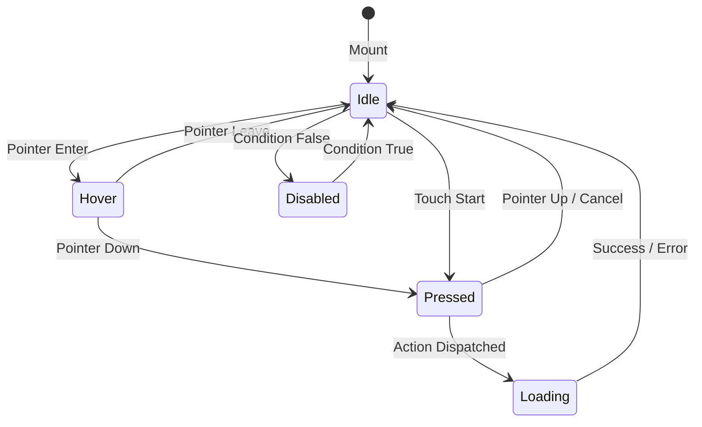

# Industrial-Grade UI/UX & Design Engineering Dossier: CulinaryOS System Architecture

> **Author:** Principal Engineer & Product Design Architect  
> **Target Surfaces:** Point of Sale (POS), Kitchen Display System (KDS), Back-Office Admin, Handheld Terminals  
> **Protocols Evaluated:** Material 3 Expressive, Apple HIG (iOS/iPadOS), Claude Artifacts/Fable Canvas, Linear Micro-Interactions, Toast Go Ergonomics, OKLCH Perceptual Tokenization  

---

## 1. Executive Summary & Design Law

Modern high-performance web and touch interfaces converge on an immutable law:

> **UI is not decoration; it is an ergonomic, predictable state machine.**  
> In mission-critical environments (such as a 200-seat dinner rush or a high-heat kitchen line), an ambiguous button affordance, a missed touch target, or an unexpected layout shift causes physical errors, delayed food, and financial loss.

This dossier defines the formal design system and engineering specifications for CulinaryOS across all viewports and hardware form factors.

---

## 2. Comparative Analysis of Leading UI/UX Frameworks

```
+-----------------------------------------------------------------------------------------------------+
| SYSTEM ARCHITECTURE TAXONOMY                                                                        |
+---------------------------+---------------------------+---------------------------------------------+
| System                    | Core Philosophy           | Key Mechanism                               |
+---------------------------+---------------------------+---------------------------------------------+
| Material 3 (M3)           | State Layers & Tokens     | Surface overlay tints (8%/12%/16% opacity)   |
| Expressive                | Physics-based springs     | 48x48dp minimum touch bounds                |
+---------------------------+---------------------------+---------------------------------------------+
| Apple HIG                 | Spatial Ergonomics        | Ergonomic bottom thumb zone                 |
| (Jakob's Law)             | Natural Gestures          | Fluid bottom sheets & drawer dismissal      |
+---------------------------+---------------------------+---------------------------------------------+
| Claude Artifacts / Fable  | Dual-Pane Canvas & Tool   | Reactive split-pane yielding to live canvas |
|                           | Isolated Context          | Micro-inspector sheets over modal takeovers |
+---------------------------+---------------------------+---------------------------------------------+
| Toast Go (Handheld POS)   | High-Speed One-Hand Entry | Clustered thumb buttons for Send/Pay/Split  |
|                           | Low Cognitive Load        | Inline modifier chips without modal lag     |
+---------------------------+---------------------------+---------------------------------------------+
| Linear / shadcn           | Information Density       | 1px subtle borders, tabular mono numbers,    |
|                           | Keyboard-First Speed      | Active press spring: active:scale-[0.97]    |
+---------------------------+---------------------------+---------------------------------------------+
```

### Critical Takeaways for CulinaryOS:
1. **From Toast Go:** Never force a server to reach to the top of a handheld screen during order entry. Primary actions (`Send to Kitchen`, `Pay`, `Hold`, `Fire`) must live in the bottom 30% thumb zone.
2. **From Claude Artifacts/Fable:** The active canvas (3D floor map, menu grid, or ticket rail) must not be destroyed or hidden when opening auxiliary details. Use floating slide-over sheets or drawer inspectors.
3. **From Material 3 Expressive:** Replace arbitrary hover colors with **State Layers** (semi-transparent overlays) and **Physics-based Active Transforms**.
4. **From OKLCH Color Space:** Replace legacy HSL/RGB colors with perceptually uniform lightness tokens to guarantee 4.5:1 WCAG 2.2 AA contrast across both light bistro and dark kitchen environments.

---

## 3. Button & Interactive Element Engineering Specification

### 3.1 The 6 Mandatory Interaction States
Every button, table chip, and modifier toggle must implement the following deterministic state machine:



1. **Idle (Resting):** Explicit container boundary (`border border-border`), high-contrast text (`text-foreground`), and clear elevation token.
2. **Hover (Pointer Devices):** 8% lightness shift or semi-transparent tonal overlay (`hover:bg-primary/90` or `hover:bg-accent`).
3. **Focus-Visible (Keyboard & Barcode Scanners):** 2px solid ring with 2px offset (`focus-visible:ring-2 focus-visible:ring-ring focus-visible:ring-offset-2`). Must never be suppressed.
4. **Pressed / Active (Haptic Simulation):** Spring compression transform:
   ```css
   active:scale-[0.97] transition-transform duration-75 ease-out
   ```
5. **Loading / Optimistic Execution:** Button maintains strict width and height (`min-w-[...] h-11`) so text-to-spinner transitions cause **zero layout jitter**. Pointer events disabled.
6. **Disabled:** Reduced opacity (`opacity-50`), `cursor-not-allowed`, and `aria-disabled="true"`.

### 3.2 The 48px Physical Touch Target Rule
- **Physical Dimension:** The minimum interactive bounding box for any tap target must be **48×48 CSS pixels** (Apple HIG & Material 3), even if the visual icon inside is 18px.
- **Spacing:** Interactive targets must have at least **8px** of dead space between them to prevent adjacent accidental presses during rapid multi-touch input.

```html
<!-- Example of 48px Touch Target with Compact Visual Icon -->
<button class="relative h-12 w-12 flex items-center justify-center rounded-xl bg-secondary text-secondary-foreground active:scale-95 transition-all">
  <span class="sr-only">Add Seat</span>
  <Plus className="w-5 h-5" />
</button>
```

---

## 4. Perceptually Uniform Design Tokens (OKLCH)

CulinaryOS transitions to **OKLCH (Lightness, Chroma, Hue)** for color definitions. Because OKLCH lightness ($L$) is mathematically uniform across all hues, setting $L=0.98$ for surfaces and $L=0.20$ for text mathematically guarantees a contrast ratio $\ge 7:1$ regardless of whether the theme is navy, emerald, or amber.

```css
@layer base {
  :root {
    /* Brand Foundation */
    --brand-primary:    oklch(0.25 0.05 260); /* Deep Slate Navy */
    --brand-accent:     oklch(0.68 0.18 45);  /* Warm Amber/Gold */
    --brand-success:    oklch(0.62 0.19 145); /* Emerald Green */
    --brand-danger:     oklch(0.58 0.22 25);  /* Crimson Red */

    /* Semantic Surfaces (Light Bistro Mode) */
    --bg-app:           oklch(0.98 0.005 260);
    --surface-card:     oklch(1.00 0.000 0);
    --surface-elevated: oklch(0.96 0.008 260);
    --border-subtle:    oklch(0.90 0.010 260);
    --text-primary:     oklch(0.18 0.020 260);
    --text-secondary:   oklch(0.45 0.025 260);
  }

  .dark {
    /* Kitchen High-Heat / Dark Mode */
    --bg-app:           oklch(0.12 0.015 260);
    --surface-card:     oklch(0.18 0.020 260);
    --surface-elevated: oklch(0.24 0.025 260);
    --border-subtle:    oklch(0.28 0.020 260);
    --text-primary:     oklch(0.98 0.005 260);
    --text-secondary:   oklch(0.75 0.015 260);
  }
}
```

---

## 5. Viewport Adaptation Architecture (POS & KDS)

### 5.1 Desktop/Countertop Terminal ($\ge$ 1024px)
- **Dual-Pane Canvas:** Left 380px fixed ticket order receipt (`OrderView`); Right flex canvas (`MenuView` / `FloorMap3D`).
- **Zero Modal Blocking:** Modifiers and notes open in an inline side tray, allowing the cashier to see the menu, ticket, and modifier simultaneously.

### 5.2 Handheld / Mobile Terminal (< 1024px)
- **Single Canvas + Floating Cart Bar:** Full screen dedicated to Menu Grid or Floor Map.
- **Sticky Bottom Thumb Dock (h-16):**
  ```
  [ 🛒 3 Items • $42.50 ] -------------> [ SEND TO KITCHEN / PAY ➔ ]
  ```
- **Swipeable Bottom Sheet (`CheckoutDrawer`):** Swiping up expands the full item breakdown, seat assignment, and discount toggles. Tapping anywhere outside dismisses without loss of state.

---

## 6. KDS High-Rush Ergonomics

1. **Top All-Day Summary Bar:**
   - Displays real-time aggregate counts across all active tickets:
     `[8] Prime Burgers  |  [5] Margherita Pizzas  |  [3] Truffle Calamari  |  [2] Ribeye Med-Rare`
   - Line cooks do not count tickets manually; they read the batch requirement immediately.
2. **Color-Coded Ticket Aging Matrix:**
   - `< 8 minutes:` Neutral / Slate border (Normal pacing)
   - `8 – 15 minutes:` Amber border with pulse (Approaching threshold)
   - `> 15 minutes:` High-contrast flashing Red border with bold elapsed timer
3. **Hardware Bump Bar / Hotkey Support:**
   - Full keyboard accessibility:
     - `Space` or `Enter`: Bump primary ticket
     - `1` through `8`: Focus ticket by index
     - `R`: Recall last bumped ticket
     - `S`: Cycle station filter (All -> Grill -> Fry -> Cold -> Expo)

---

## 7. Migration & Scaffolding Execution Plan

1. **Upgrade `@culinaryos/ui` Core Primitives:**
   - Inject M3 active state physics (`active:scale-[0.97]`) and `min-h-[48px]` touch targets into `Button.tsx`.
   - Add unified `Sheet` and `Drawer` primitives backed by Radix Dialog.
2. **Refactor `apps/pos` Layout:**
   - Replace fixed `w-80` sidebar with responsive media query: side-by-side on $\ge$1024px, collapsible bottom cart sheet on $<1024px$.
3. **Add Inline Fast Modifiers:**
   - Render common quick-modifiers as selectable chips under item cards.
4. **Deploy KDS All-Day Aggregate Counter:**
   - Inject ticket summarizer hook and top header bar in `apps/kds`.
