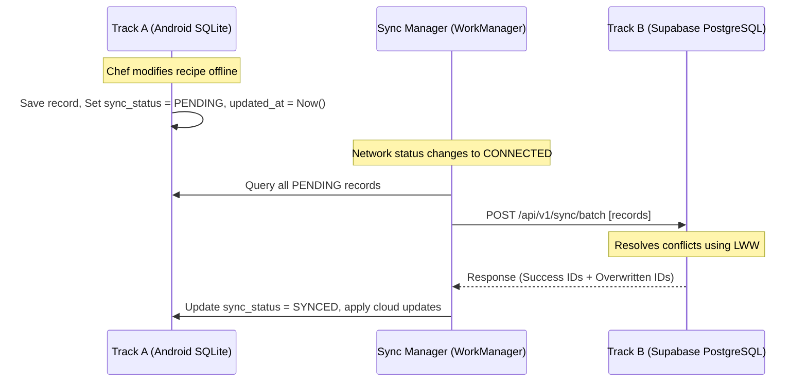

# 🔌 API & Sync Documentation

This document outlines the REST API specifications (Phase 4) and the bi-directional data synchronization protocol (Phase 3) between Track A (local Room database) and Track B (cloud Supabase database).

---

## 🔌 REST API Endpoints (OpenAPI V3 Style)

All public API requests require an `Authorization: Bearer <JWT_TOKEN>` header, authenticated via Supabase Auth.

### 1. Recipe Syndication (`/api/v1/recipes`)

#### `GET /api/v1/recipes`
Fetch a list of recipes for the authenticated tenant.

* **Query Parameters:**
  * `limit` (int): default 20
  * `offset` (int): default 0
  * `location_id` (UUID): Optional location filter.
* **Response (200 OK):**
  ```json
  [
    {
      "id": "c30f40d8-19b8-4c6e-82d2-8b2b64d420c2",
      "name": "Cinnamon Sourdough",
      "description": "Standard sourdough batched with cinnamon swirls",
      "yield_quantity": 2.0,
      "yield_unit": "Loaves",
      "updated_at": 1781524800000,
      "ingredients": [
        {
          "ingredient_id": "d12e9874-8b65-4f22-9fa9-4a0b5a6c3da9",
          "name": "Bread Flour",
          "ratio_percentage": 100.0,
          "base_weight_grams": 800.0,
          "is_base_flour": true
        }
      ]
    }
  ]
  ```

#### `POST /api/v1/recipes`
Create a new recipe in the system.

* **Request Body:** Same schema as the GET response item (excluding autogenerated fields like `id`).
* **Response (201 Created):** Returns the saved recipe JSON with populated `id`.

---

### 2. Inventory Hooks (`/api/v1/inventory`)

#### `PATCH /api/v1/inventory/{item_id}`
Adjust inventory quantity on hand. Primarily used by physical count workflows.

* **Request Body:**
  ```json
  {
    "quantity_on_hand": 14.5,
    "adjustment_reason": "Physical Count Sunday"
  }
  ```
* **Response (200 OK):**
  ```json
  {
    "id": "e5512b98-38bc-4672-9118-ef4f00b21a8a",
    "item_name": "Unbleached Bread Flour",
    "updated_quantity": 14.500,
    "variance_detected": -2.300
  }
  ```

---

## 🔄 Track A ↔ Track B Bi-Directional Sync Protocol

To achieve seamless offline-first capability, Track A (Android) stores all inputs in a local Room database, queueing synchronization events for when a stable network is detected.



### 1. The Sync Database Schema (Track A Local)
Every row in SQLite has the following properties:
* `id`: `TEXT` (UUID string).
* `updated_at`: `INTEGER` (Epoch milliseconds timestamp of the last local write).
* `sync_status`: `TEXT` (`PENDING`, `SYNCED`, `ERROR`).
* `is_deleted`: `INTEGER` (0 for false, 1 for true). *Never hard-delete records offline.*

### 2. Conflict-Resolution Rules (Last-Write-Wins)
When the cloud sync endpoint receives records, it handles conflicts at the row level:

```sql
-- Conceptual Upsert Trigger logic in PostgreSQL Sync Gateway
INSERT INTO recipes (id, name, description, yield_quantity, yield_unit, updated_at, is_deleted)
VALUES ($1, $2, $3, $4, $5, $6, $7)
ON CONFLICT (id) DO UPDATE 
SET 
    name = EXCLUDED.name,
    description = EXCLUDED.description,
    yield_quantity = EXCLUDED.yield_quantity,
    yield_unit = EXCLUDED.yield_unit,
    updated_at = EXCLUDED.updated_at,
    is_deleted = EXCLUDED.is_deleted
WHERE EXCLUDED.updated_at > recipes.updated_at; -- ONLY update if incoming record is newer
```

### 3. Sync Trigger Sequence
1. **Network Connectivity Listener:** The Android app registers a `ConnectivityManager.NetworkCallback`. When connection is restored, it triggers a background sync task via `WorkManager`.
2. **Periodic Sync:** A recurring sync runs every 15 minutes while the app is in the foreground.
3. **Manual Push:** A swipe-to-refresh action on the home screen triggers an immediate forced sync.
4. **Soft Delete Cleanup:** Rows flagged as `is_deleted = true` are filtered out of UI queries. The Cloud sync server performs a daily cron job to move soft-deleted records older than 30 days to an audit archive.
