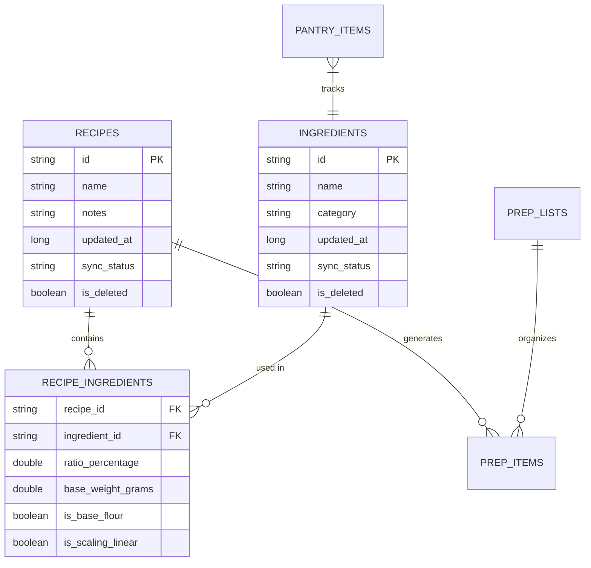

# 🗄️ Track A — Room Database Schema

This document defines the SQLite entity architecture for the local-first Android application (`RecipeOS`), built using Android Jetpack Room.

---

## 🔀 Entity Relationship Diagram



---

## 💾 Room Entity Definitions (Kotlin)

To facilitate Phase 3 synchronization with the cloud Supabase database, **all tables must use UUID Strings as primary keys** rather than auto-incrementing integers. This prevents ID collisions across multiple offline client devices.

### 1. Common Sync Columns & Enum

```kotlin
enum class SyncStatus {
    SYNCED,
    PENDING,
    ERROR
}

interface SyncableEntity {
    val id: String       // UUID format
    val updatedAt: Long  // Epoch millisecond timestamp
    val syncStatus: SyncStatus
    val isDeleted: Boolean
}
```

### 2. Recipe Entity
Represents the recipe header data.

```kotlin
@Entity(
    tableName = "recipes",
    indices = [Index(value = ["updated_at"]), Index(value = ["is_deleted"])]
)
data class RecipeEntity(
    @PrimaryKey
    override val id: String = UUID.randomUUID().toString(),
    val name: String,
    val description: String?,
    val yieldQuantity: Double,
    val yieldUnit: String, // e.g., "Loaves", "Servings"
    
    @ColumnInfo(name = "updated_at")
    override val updatedAt: Long = System.currentTimeMillis(),
    @ColumnInfo(name = "sync_status")
    override val syncStatus: SyncStatus = SyncStatus.PENDING,
    @ColumnInfo(name = "is_deleted")
    override val isDeleted: Boolean = false
) : SyncableEntity
```

### 3. Ingredient Entity
Global directory of ingredients.

```kotlin
@Entity(
    tableName = "ingredients",
    indices = [Index(value = ["name"], unique = true)]
)
data class IngredientEntity(
    @PrimaryKey
    override val id: String = UUID.randomUUID().toString(),
    val name: String,
    val category: String, // e.g., "Flour", "Liquid", "Leaven", "Fat", "Spice"
    val isAllergen: Boolean = false,
    
    @ColumnInfo(name = "updated_at")
    override val updatedAt: Long = System.currentTimeMillis(),
    @ColumnInfo(name = "sync_status")
    override val syncStatus: SyncStatus = SyncStatus.PENDING,
    @ColumnInfo(name = "is_deleted")
    override val isDeleted: Boolean = false
) : SyncableEntity
```

### 4. Recipe Ingredient Cross-Reference
Many-to-many relationship defining ratios and scaling parameters.

```kotlin
@Entity(
    tableName = "recipe_ingredients",
    primaryKeys = ["recipe_id", "ingredient_id"],
    foreignKeys = [
        ForeignKey(
            entity = RecipeEntity::class,
            parentColumns = ["id"],
            childColumns = ["recipe_id"],
            onDelete = ForeignKey.CASCADE
        ),
        ForeignKey(
            entity = IngredientEntity::class,
            parentColumns = ["id"],
            childColumns = ["ingredient_id"],
            onDelete = ForeignKey.RESTRICT
        )
    ],
    indices = [Index(value = ["recipe_id"]), Index(value = ["ingredient_id"])]
)
data class RecipeIngredientCrossRef(
    @ColumnInfo(name = "recipe_id")
    val recipeId: String,
    @ColumnInfo(name = "ingredient_id")
    val ingredientId: String,
    
    @ColumnInfo(name = "ratio_percentage")
    val ratioPercentage: Double, // Baker's percentage, relative to flour base (100.0)
    @ColumnInfo(name = "base_weight_grams")
    val baseWeightGrams: Double, // The reference weight at 1.0x batch scale
    
    @ColumnInfo(name = "is_base_flour")
    val isBaseFlour: Boolean = false, // If true, this ingredient forms the 100% baseline
    @ColumnInfo(name = "is_scaling_linear")
    val isScalingLinear: Boolean = true // If false, yeast/salt formulas use adjusted curves
)
```

### 5. Pantry & Stock Tracking Entity
Tracks the quantities physically on-hand.

```kotlin
@Entity(
    tableName = "pantry_items",
    foreignKeys = [
        ForeignKey(
            entity = IngredientEntity::class,
            parentColumns = ["id"],
            childColumns = ["ingredient_id"],
            onDelete = ForeignKey.CASCADE
        )
    ],
    indices = [Index(value = ["ingredient_id"], unique = true)]
)
data class PantryItemEntity(
    @PrimaryKey
    override val id: String = UUID.randomUUID().toString(),
    @ColumnInfo(name = "ingredient_id")
    val ingredientId: String,
    
    val quantityOnHand: Double,
    val quantityUnit: String, // e.g. "kg", "g", "liters"
    val parLevel: Double, // Target minimum quantity
    val binLocation: String?, // e.g. "Dry Storage Shelf A"
    
    @ColumnInfo(name = "updated_at")
    override val updatedAt: Long = System.currentTimeMillis(),
    @ColumnInfo(name = "sync_status")
    override val syncStatus: SyncStatus = SyncStatus.PENDING,
    @ColumnInfo(name = "is_deleted")
    override val isDeleted: Boolean = false
) : SyncableEntity
```

### 6. Prep List and Prep Item Entities
Used to plan kitchen production.

```kotlin
@Entity(tableName = "prep_lists")
data class PrepListEntity(
    @PrimaryKey
    override val id: String = UUID.randomUUID().toString(),
    val targetDate: Long, // Epoch timestamp for the prep day
    val notes: String?,
    
    @ColumnInfo(name = "updated_at")
    override val updatedAt: Long = System.currentTimeMillis(),
    @ColumnInfo(name = "sync_status")
    override val syncStatus: SyncStatus = SyncStatus.PENDING,
    @ColumnInfo(name = "is_deleted")
    override val isDeleted: Boolean = false
) : SyncableEntity

@Entity(
    tableName = "prep_items",
    foreignKeys = [
        ForeignKey(
            entity = PrepListEntity::class,
            parentColumns = ["id"],
            childColumns = ["prep_list_id"],
            onDelete = ForeignKey.CASCADE
        ),
        ForeignKey(
            entity = RecipeEntity::class,
            parentColumns = ["id"],
            childColumns = ["recipe_id"],
            onDelete = ForeignKey.SET_NULL
        )
    ],
    indices = [Index(value = ["prep_list_id"]), Index(value = ["recipe_id"])]
)
data class PrepItemEntity(
    @PrimaryKey
    override val id: String = UUID.randomUUID().toString(),
    @ColumnInfo(name = "prep_list_id")
    val prepListId: String,
    @ColumnInfo(name = "recipe_id")
    val recipeId: String?,
    
    val taskDescription: String,
    val scaledBatchSize: Double, // The multiplier applied (e.g. 2.5x)
    val isCompleted: Boolean = false,
    val completedByStaffId: String?, // References web staff schema when synced
    
    @ColumnInfo(name = "updated_at")
    override val updatedAt: Long = System.currentTimeMillis(),
    @ColumnInfo(name = "sync_status")
    override val syncStatus: SyncStatus = SyncStatus.PENDING,
    @ColumnInfo(name = "is_deleted")
    override val isDeleted: Boolean = false
) : SyncableEntity
```

---

## 🔄 Room Type Converters

To store Enums, Dates, and UUIDs properly as standard SQLite primitives, Room uses custom converters:

```kotlin
class DatabaseConverters {
    @TypeConverter
    fun fromSyncStatus(status: SyncStatus): String = status.name

    @TypeConverter
    fun toSyncStatus(status: String): SyncStatus = SyncStatus.valueOf(status)
}
```
