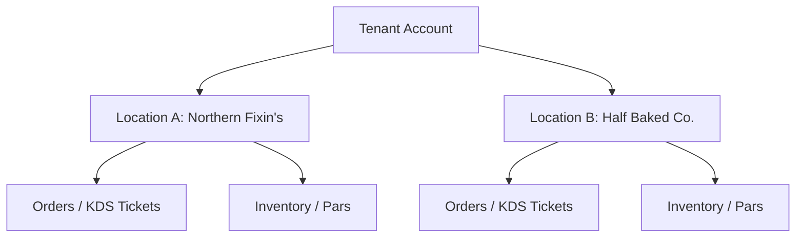

# 🌐 Track B — Base44 Entity Reference

This document outlines the Supabase PostgreSQL schema for the **CulinaryOS Web / KitchenFlow ERP** platform (currently operating as "Northern Fixin's").

---

## 🏢 Tenant & Multi-Location Isolation

To support multiple locations (e.g., *Northern Fixin's* and *Half Baked Cafe*) sharing a single database, all tables enforce strict data separation using PostgreSQL **Row Level Security (RLS)**.



### Row Level Security (RLS) Template
Every data access query matches against the active user's location access level:

```sql
-- Enable Row Level Security
ALTER TABLE pos_orders ENABLE ROW LEVEL SECURITY;

-- Create policy to restrict access to authenticated staff matching location_id
CREATE POLICY location_staff_isolation ON pos_orders
    FOR ALL
    TO authenticated
    USING (location_id = ANY (select auth.jwt() -> 'user_metadata' ->> 'allowed_locations'));
```

---

## 🗄️ Database Tables & Data Models

### 1. Locations Table
```sql
CREATE TABLE locations (
    id UUID PRIMARY KEY DEFAULT gen_random_uuid(),
    tenant_id UUID NOT NULL,
    name VARCHAR(255) NOT NULL,
    address TEXT,
    timezone VARCHAR(100) DEFAULT 'America/New_York',
    created_at TIMESTAMP WITH TIME ZONE DEFAULT timezone('utc'::text, now()) NOT NULL
);
```

### 2. POS Orders & Payments (Point of Sale)
Tracks sales, tips, payments, and dining status.

```sql
CREATE TYPE order_status AS ENUM ('pending', 'processing', 'completed', 'cancelled', 'refunded');
CREATE TYPE order_type AS ENUM ('dine_in', 'takeout', 'delivery', 'catering');

CREATE TABLE pos_orders (
    id UUID PRIMARY KEY DEFAULT gen_random_uuid(),
    location_id UUID REFERENCES locations(id) ON DELETE CASCADE,
    staff_id UUID NOT NULL, -- References auth.users
    customer_id UUID, -- References crm_customers(id)
    status order_status NOT NULL DEFAULT 'pending',
    type order_type NOT NULL DEFAULT 'dine_in',
    table_number VARCHAR(20),
    
    subtotal DECIMAL(12, 2) NOT NULL DEFAULT 0.00,
    tax_amount DECIMAL(12, 2) NOT NULL DEFAULT 0.00,
    tip_amount DECIMAL(12, 2) NOT NULL DEFAULT 0.00,
    total_amount DECIMAL(12, 2) GENERATED ALWAYS AS (subtotal + tax_amount + tip_amount) STORED,
    
    created_at TIMESTAMP WITH TIME ZONE DEFAULT timezone('utc'::text, now()) NOT NULL,
    updated_at TIMESTAMP WITH TIME ZONE DEFAULT timezone('utc'::text, now()) NOT NULL
);

CREATE TABLE pos_order_items (
    id UUID PRIMARY KEY DEFAULT gen_random_uuid(),
    order_id UUID REFERENCES pos_orders(id) ON DELETE CASCADE,
    item_name VARCHAR(255) NOT NULL,
    quantity INTEGER NOT NULL CHECK (quantity > 0),
    unit_price DECIMAL(10, 2) NOT NULL,
    modifiers JSONB DEFAULT '[]'::jsonb, -- e.g., ["extra cheese", "no onions"]
    discount_amount DECIMAL(10, 2) DEFAULT 0.00
);

CREATE TABLE pos_payments (
    id UUID PRIMARY KEY DEFAULT gen_random_uuid(),
    order_id UUID REFERENCES pos_orders(id) ON DELETE CASCADE,
    stripe_charge_id VARCHAR(255), -- Populated when online/connected
    payment_method VARCHAR(50) NOT NULL, -- e.g. "card", "cash", "loyalty"
    amount_paid DECIMAL(12, 2) NOT NULL,
    is_offline_fallback BOOLEAN DEFAULT FALSE,
    captured_at TIMESTAMP WITH TIME ZONE DEFAULT timezone('utc'::text, now()) NOT NULL
);
```

---

### 3. Kitchen Display System (KDS) Queue
Real-time active ticket queue supporting priority sorting.

```sql
CREATE TYPE ticket_status AS ENUM ('queued', 'prep', 'ready', 'bumped');

CREATE TABLE kds_tickets (
    id UUID PRIMARY KEY DEFAULT gen_random_uuid(),
    location_id UUID REFERENCES locations(id) ON DELETE CASCADE,
    order_id UUID REFERENCES pos_orders(id) ON DELETE SET NULL,
    status ticket_status NOT NULL DEFAULT 'queued',
    priority_score INTEGER DEFAULT 0, -- Scaled by prep time & wait time
    
    assigned_station VARCHAR(50), -- e.g. "Grill", "Salad", "Bake"
    created_at TIMESTAMP WITH TIME ZONE DEFAULT timezone('utc'::text, now()) NOT NULL,
    bumped_at TIMESTAMP WITH TIME ZONE
);
```

---

### 4. Inventory, Physical Counts & Variances
Real-time stock ledger syncing with smart 86'd alerts.

```sql
CREATE TABLE inventory_items (
    id UUID PRIMARY KEY DEFAULT gen_random_uuid(),
    location_id UUID REFERENCES locations(id) ON DELETE CASCADE,
    name VARCHAR(255) NOT NULL,
    sku VARCHAR(100),
    stock_quantity DECIMAL(12, 3) NOT NULL DEFAULT 0.000,
    unit VARCHAR(50) NOT NULL, -- "g", "kg", "units", "cases"
    par_level DECIMAL(12, 3) NOT NULL,
    cost_per_unit DECIMAL(10, 4) NOT NULL,
    supplier_id UUID,
    
    updated_at TIMESTAMP WITH TIME ZONE DEFAULT timezone('utc'::text, now()) NOT NULL
);

CREATE TABLE inventory_variance_logs (
    id UUID PRIMARY KEY DEFAULT gen_random_uuid(),
    inventory_item_id UUID REFERENCES inventory_items(id) ON DELETE CASCADE,
    recorded_by UUID NOT NULL,
    expected_qty DECIMAL(12, 3) NOT NULL,
    actual_qty DECIMAL(12, 3) NOT NULL,
    variance_qty DECIMAL(12, 3) GENERATED ALWAYS AS (actual_qty - expected_qty) STORED,
    reason VARCHAR(255), -- e.g. "spillage", "theft", "unrecorded sale"
    created_at TIMESTAMP WITH TIME ZONE DEFAULT timezone('utc'::text, now()) NOT NULL
);
```

---

### 5. CRM, Loyalty Tiers & Customers
Manages customer spend history and automatic loyalty rewards.

```sql
CREATE TYPE loyalty_tier AS ENUM ('bronze', 'silver', 'gold', 'platinum');

CREATE TABLE crm_customers (
    id UUID PRIMARY KEY DEFAULT gen_random_uuid(),
    tenant_id UUID NOT NULL,
    first_name VARCHAR(100) NOT NULL,
    last_name VARCHAR(100) NOT NULL,
    email VARCHAR(255) UNIQUE,
    phone VARCHAR(50),
    
    tier loyalty_tier NOT NULL DEFAULT 'bronze',
    points_balance INTEGER NOT NULL DEFAULT 0,
    total_spend DECIMAL(12, 2) NOT NULL DEFAULT 0.00,
    
    created_at TIMESTAMP WITH TIME ZONE DEFAULT timezone('utc'::text, now()) NOT NULL
);
```

---

### 6. Staff Scheduling & HR
Tracks shifts, payroll coefficients, and scheduling conflicts.

```sql
CREATE TABLE staff_roster (
    id UUID PRIMARY KEY DEFAULT gen_random_uuid(),
    location_id UUID REFERENCES locations(id) ON DELETE CASCADE,
    first_name VARCHAR(100) NOT NULL,
    last_name VARCHAR(100) NOT NULL,
    role VARCHAR(50) NOT NULL, -- "Chef", "Sous Chef", "Line Cook", "Server"
    hourly_rate DECIMAL(10, 2) NOT NULL
);

CREATE TABLE work_shifts (
    id UUID PRIMARY KEY DEFAULT gen_random_uuid(),
    staff_id UUID REFERENCES staff_roster(id) ON DELETE CASCADE,
    start_time TIMESTAMP WITH TIME ZONE NOT NULL,
    end_time TIMESTAMP WITH TIME ZONE NOT NULL,
    notes TEXT,
    CONSTRAINT check_shift_times CHECK (end_time > start_time)
);
```

---

## 📈 Key PostgreSQL Indexes (For Real-Time KDS/POS)

```sql
-- Optimize KDS screen queries filtering active orders
CREATE INDEX idx_kds_active ON kds_tickets (location_id, status) WHERE status != 'bumped';

-- Optimize inventory lookups
CREATE INDEX idx_inventory_location ON inventory_items (location_id);

-- Optimize CRM lookups
CREATE INDEX idx_crm_email ON crm_customers (email);
```
